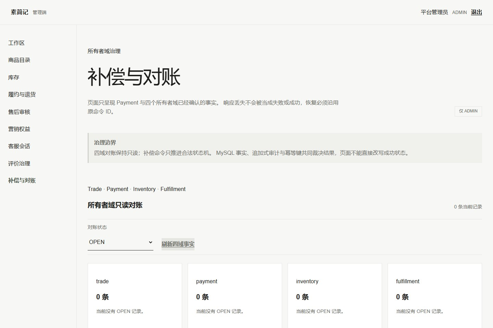
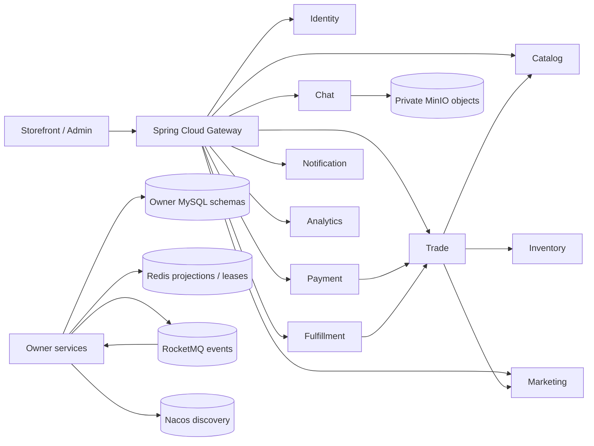

# 素简记（PlainJournal）

> 把复杂留给系统，把简单交给用户。

[](https://github.com/NoctilumeDev/PlainJournal/actions/workflows/ci.yml)
[](https://github.com/NoctilumeDev/PlainJournal/actions/workflows/security.yml)
[](https://noctilumedev.github.io/PlainJournal/)
[](LICENSE)

PlainJournal 是一个单经营主体、自营 B2C 分布式电商项目。它使用 Spring Boot 3、
JDK 17 和 Vue 3，围绕数据所有权、交易一致性、结果未知恢复、多实例竞争和故障治理
建立可运行实现，而不是用服务数量代替工程证据。

当前仓库冻结为 `v1.0.x`：保留完整业务闭环，只修复明确缺陷和工程边界；多商户、
平台分账、Go 异构服务和新的大型业务模块不再加入。前端后续可在 `v1.1.0` 单独进行
视觉重构，但不能改变所有者事实和交易状态机。

## 成品预览

[在线预览](https://noctilumedev.github.io/PlainJournal/) 使用 GitHub Pages 展示当前
成品和运行边界，不冒充真实后端环境。




## 核心能力

- **所有者事实明确**：Identity、Catalog、Inventory、Trade、Payment、
  Fulfillment、Marketing、Chat、Notification、Analytics 分别持有自己的 Schema
  和数据库账号，不共享 Mapper 或 Entity。
- **一致性可恢复**：本地事务、Outbox、RocketMQ、幂等消费、有限重试、补偿记录和
  对账共同处理跨服务收敛，不把超时直接解释为失败。
- **多实例有真实证据**：代表服务使用三实例验证租约抢占、消费者竞争、滚动发布、
  进程终止和旧新版本边界。
- **容量与故障分开证明**：1000 请求 / 100 并发基线、Redis 降级、MQ 停机恢复、
  读副本、分片、归档、ClamAV 和 OpenSearch 均按互斥 Profile 串行验证。
- **前后端交付闭环**：顾客端和管理端包含类型、单元/契约、Playwright、axe、
  生产构建、Nginx 缓存/404/同源代理和响应式 AVIF/WebP 图片门禁。

## 架构



同步调用只用于立即裁决；跨域最终收敛使用版本化事件。完整调用、事件和数据库边界见
[服务架构](docs/02-service-architecture.md)、[数据所有权](docs/04-data-ownership.md)
和[一致性策略](docs/05-consistency-strategy.md)。

## 快速演示

UI Demo 只需要 Node.js 和 pnpm，不启动 Docker 或 Java：

```bash
git clone https://github.com/NoctilumeDev/PlainJournal.git
cd PlainJournal/frontend
corepack enable
pnpm install --frozen-lockfile
pnpm demo:start
```

- 顾客端：`http://127.0.0.1:18300`
- 管理端：`http://127.0.0.1:18301`

演示账号：

| 身份 | 邮箱 | 密码 |
| --- | --- | --- |
| 顾客 | `reader@example.com` | `ReaderPass123` |
| 第二顾客 | `reader-two@example.com` | `ReaderPass123` |
| 管理员 | `admin@example.com` | `AdminPass123` |

完成后运行 `pnpm demo:stop`。这些账号是内存夹具，不是真实生产凭据。

## 三档运行

| 档位 | 用途 | 入口 |
| --- | --- | --- |
| UI Demo | 查看产品、响应式布局和交互 | `cd frontend && pnpm demo:start` |
| Core Smoke | 验证真实核心交易链和清理 | `cd backend && ./tools/verify-core-smoke.ps1` |
| Full Lab | 多实例、故障、容量、分片、Chat、搜索与观测 | [验证索引](docs/verification-index.md) |

后端基础构建使用 Maven Wrapper：

```bash
cd backend
./mvnw clean verify
./mvnw -DskipTests install org.apache.maven.plugins:maven-pmd-plugin:3.28.0:check
```

Windows `cmd.exe` 可使用 `mvnw.cmd`。真实中间件准备见
[Docker 说明](deploy/docker/README.md)，Core Smoke 资源和时间边界见
[冷启动指南](docs/core-smoke.md)。

## 当前验证

当前单一事实源是 [验证摘要](docs/verification-summary.md)：

| 范围 | 最近完整基线 |
| --- | --- |
| 后端 | 100 份 Surefire 报告，436 tests，0 failure/error/skipped |
| PMD / SpotBugs | PMD 0；SpotBugs P1=0，P2/P3 进入公开分类台账 |
| 前端 | 303 单元/契约、60 开发态 E2E、3 生产构建 E2E |
| 真实机制 | 7 个核心中间件、代表服务三实例、1000/100 容量与 F12/CDP |

GitHub Actions 公开复跑后端、前端、架构、文档和安全门禁。真实 MySQL、Redis、
Nacos、RocketMQ、MinIO、ClamAV、OpenSearch、故障与容量实验继续由专项脚本证明，
不在托管 Runner 中伪造。

## 仓库结构

```text
PlainJournal/
├── backend/              # 11 个 Spring Boot 应用与真实专项脚本
├── frontend/             # Vue 3 顾客端、管理端、共享包和 Playwright
├── deploy/docker/        # 核心与按需中间件 Profile
├── docs/                 # 架构、历史、验证和阶段证据
├── online-preview/       # GitHub Pages 公开预览源文件
├── tools/                # 仓库、架构、文档和发布门禁
└── .github/              # Actions、治理模板和验证基线
```

## 文档入口

- [文档导航](docs/README.md)
- [当前验证摘要](docs/verification-summary.md)
- [项目历史与 Git 说明](docs/project-history.md)
- [验证索引](docs/verification-index.md)
- [技术版本矩阵](docs/06-version-matrix.md)
- [SpotBugs 基线与分类策略](docs/quality/spotbugs-triage.md)
- [前端开发说明](frontend/README.md)
- [后端专项说明](backend/README.md)
- [变更记录](CHANGELOG.md)

历史阶段报告保留当时数字和结论；当前版本、测试数和发布状态只从验证基线生成，不再
人工同步到十几个文档。

## 安全与贡献

生产部署前必须替换 JWT、数据库、中间件、邮件和内部服务凭据，收紧 CORS，并删除
或修改所有演示账号。漏洞请按 [安全策略](SECURITY.md) 私下报告，不要在公开 Issue
提交利用细节或凭据。

贡献范围和本地门禁见 [CONTRIBUTING.md](CONTRIBUTING.md)，社区行为边界见
[CODE_OF_CONDUCT.md](CODE_OF_CONDUCT.md)。项目采用
[Apache License 2.0](LICENSE)。
