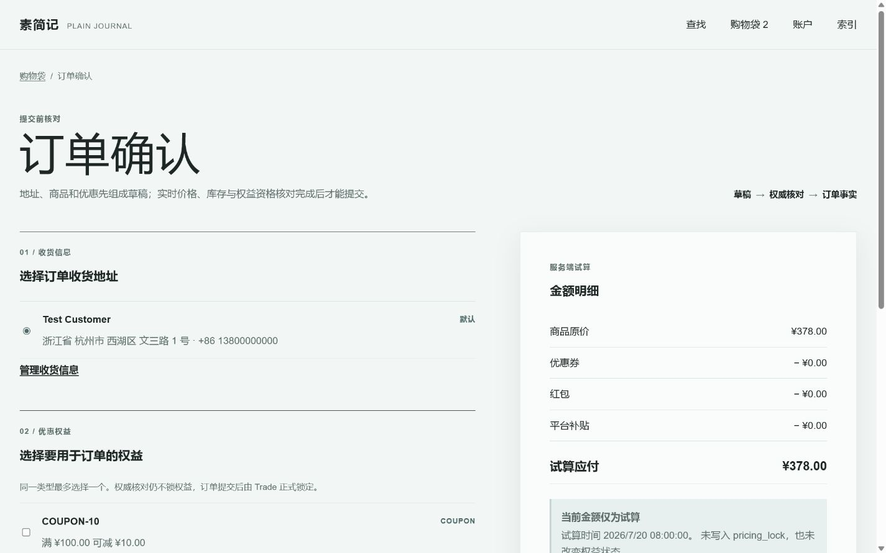
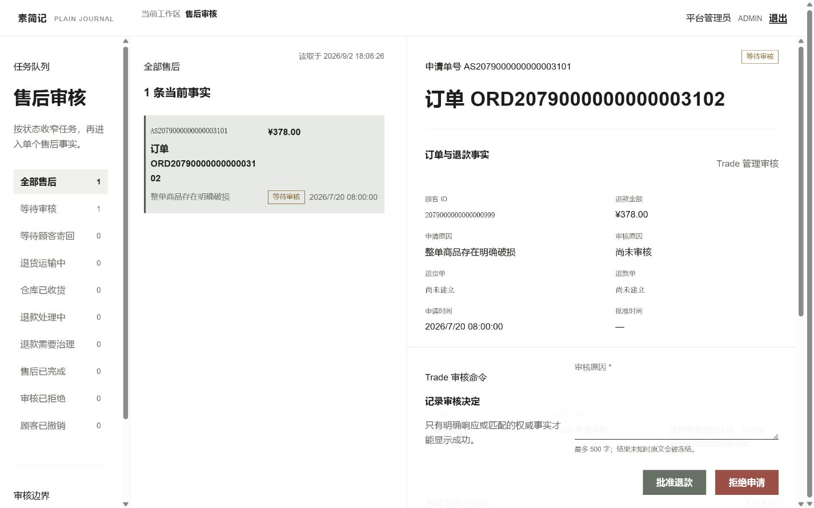
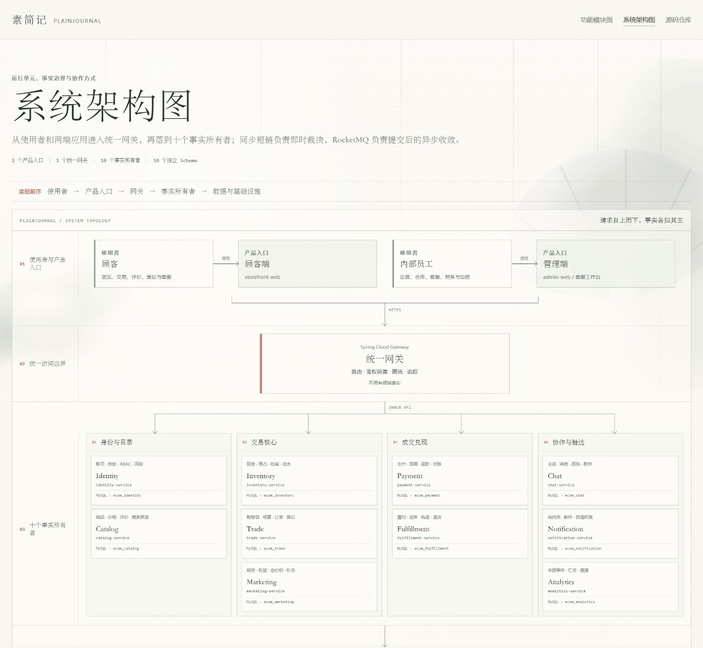
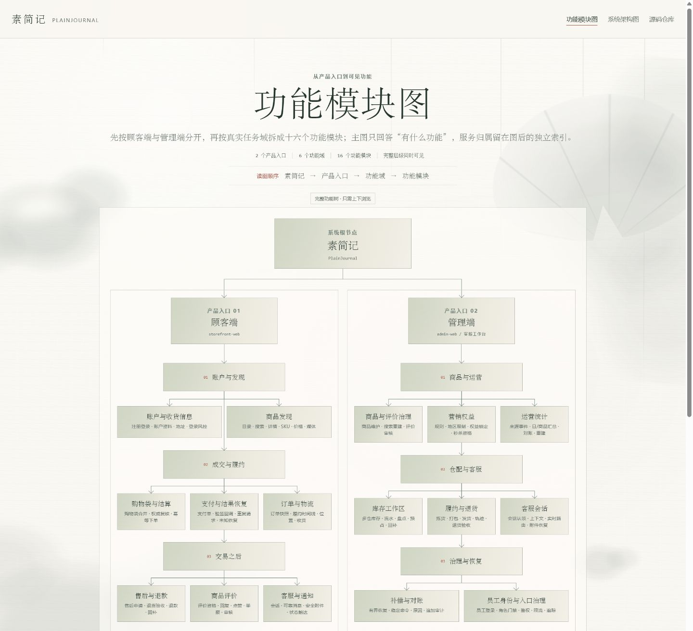
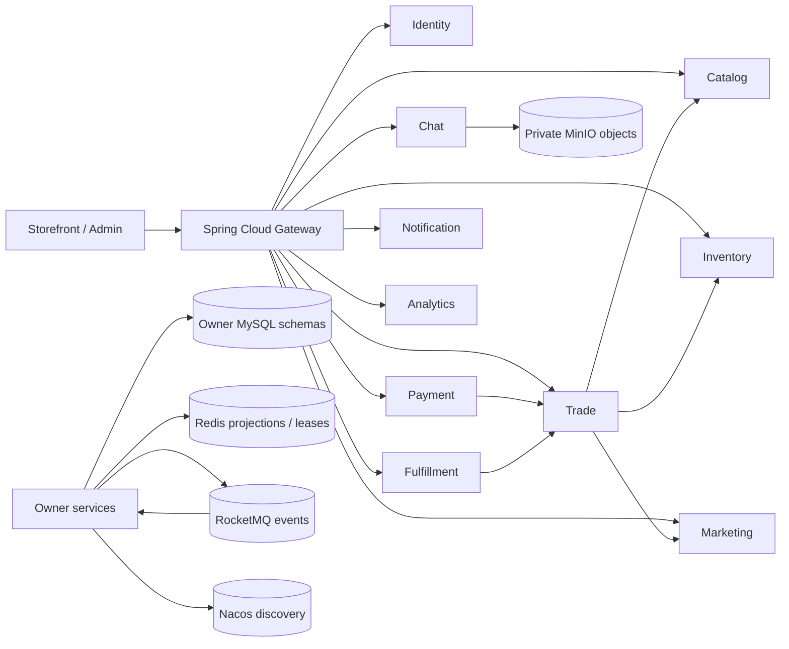

# 素简记（PlainJournal）

> 把复杂留给系统，把简单交给用户。

[](https://github.com/NoctilumeDev/PlainJournal/actions/workflows/ci.yml)
[](https://github.com/NoctilumeDev/PlainJournal/actions/workflows/security.yml)
[](https://noctilumedev.github.io/PlainJournal/)
[](LICENSE)

PlainJournal 是一个单经营主体、自营 B2C 分布式电商项目。它使用 Spring Boot 3、
JDK 17 和 Vue 3，围绕数据所有权、交易一致性、结果未知恢复、多实例竞争和故障治理
建立可运行实现，而不是用服务数量代替工程证据。

当前仓库同时保存 16GB Windows 单机、分组与串行条件下已经闭环的 M0-M8 后端历史参考
基线，以及 `v1.1.0` 完成的顾客端、管理端与特殊页面第一轮轻量化重构。前端版本只调整
页面分层、响应式布局和视觉治理，不改变所有者事实、公开 API 或交易状态机。2026-08-28
的 fresh 全拓扑复验因宿主只余约 0.46 GiB 可用物理内存而停止，没有重新取得 Core Smoke
PASS；这一真实中间件容量边界与 `v1.1.0` 已通过的前端门禁分别记录，不能压成同一次
“完整验证”。多商户、平台账本、结算和 Java/Go 异构协作进入
独立仓库 [PlainJournalPro](https://github.com/NoctilumeDev/PlainJournalPro)，完整
边界见[参考基线与 Pro 边界](docs/reference-baseline-and-pro-boundary.md)。

## 成品预览

[在线预览](https://noctilumedev.github.io/PlainJournal/) 使用 GitHub Pages 展示
`v1.1.0` 的当前页面、响应式布局和运行边界，不冒充真实后端环境。下面三张截图分别
覆盖商品选择、结算事实核对和管理端售后工作台，均由现行演示夹具在真实浏览器中截取；
验收基线继续独立保留，不与展示素材混用。






### 架构导览

- [系统架构图](https://noctilumedev.github.io/PlainJournal/visuals/system-architecture.html)：
  从使用者、两端应用和统一网关进入十个事实所有者，再区分同步短链与异步收敛；
- [功能模块图](https://noctilumedev.github.io/PlainJournal/visuals/functional-modules.html)：
  从系统根节点分出顾客端与管理端，再沿六个任务域展开 16 个真实功能模块。





两页支持桌面与手机浏览，只复用纸张材质和基础图元；结构底稿、事实清单及渲染器分别维护。
仓库门禁会把图中的服务与真实应用目录比对，避免微服务演进后文档静默漂移。

## 已完成路线

这是一条对已交付事实的回望索引，不是待实现清单，也不根据早期粗粒度提交补写虚构历史。
各阶段的完整定义、时间与证据分别以[项目总计划](docs/00-project-master-plan.md)、
[项目历史](docs/project-history.md)和[验证索引](docs/verification-index.md)为准。


路线图只负责帮助读者定位阶段；当前版本、测试数量和发布结论仍由验证基线生成，避免
README、历史文档和运行证据形成多份相互漂移的事实。

## 核心能力

- **所有者事实明确**：Identity、Catalog、Inventory、Trade、Payment、
  Fulfillment、Marketing、Chat、Notification、Analytics 分别持有自己的 Schema
  和数据库账号，不共享 Mapper 或 Entity。
- **一致性可恢复**：本地事务、Outbox、RocketMQ、幂等消费、有限重试、补偿记录和
  对账共同处理跨服务收敛，不把超时直接解释为失败。
- **多实例有真实证据**：代表服务使用三实例验证租约抢占、消费者竞争、滚动发布、
  进程终止和旧新版本边界。
- **容量与故障分开证明**：1000 请求 / 100 并发基线、Redis 降级、MQ 停机恢复、
  读副本、分片、归档、ClamAV 和 OpenSearch 均按互斥 Profile 串行验证。
- **前后端交付闭环**：顾客端和管理端包含类型、单元/契约、Playwright、axe、
  生产构建、Nginx 缓存/404/同源代理和响应式 AVIF/WebP 图片门禁。

## 架构



同步调用只用于立即裁决；跨域最终收敛使用版本化事件。完整调用、事件和数据库边界见
[服务架构](docs/02-service-architecture.md)、[数据所有权](docs/04-data-ownership.md)
和[一致性策略](docs/05-consistency-strategy.md)。

## 快速演示

UI Demo 只需要 Node.js 和 pnpm，不启动 Docker 或 Java：

```bash
git clone https://github.com/NoctilumeDev/PlainJournal.git
cd PlainJournal/frontend
corepack enable
pnpm install --frozen-lockfile
pnpm demo:start
```

- 顾客端：`http://127.0.0.1:18300`
- 管理端：`http://127.0.0.1:18301`

演示账号：

| 身份 | 邮箱 | 密码 |
| --- | --- | --- |
| 顾客 | `reader@example.com` | `ReaderPass123` |
| 第二顾客 | `reader-two@example.com` | `ReaderPass123` |
| 管理员 | `admin@example.com` | `AdminPass123` |

完成后运行 `pnpm demo:stop`。这些账号是内存夹具，不是真实生产凭据。

## 三档运行

| 档位 | 用途 | 入口 |
| --- | --- | --- |
| UI Demo | 查看产品、响应式布局和交互 | `cd frontend && pnpm demo:start` |
| Core Smoke | 验证真实核心交易链和清理 | `cd backend && ./tools/verify-core-smoke.ps1` |
| Full Lab | 多实例、故障、容量、分片、Chat、搜索与观测 | [验证索引](docs/verification-index.md) |

### 可复现业务数据

仓库不提交真实 MySQL 数据、数据库文件或真实数据导出。需要在新电脑上使用真实
MySQL 开发时，先按 [Docker 说明](deploy/docker/README.md) 创建本地资源并运行一次
Core Smoke，让各服务以自己的 Flyway 迁移建立结构；随后使用仓库内的确定性合成
数据：

```powershell
cd backend
./tools/prepare-local-demo-data.ps1 -Action Seed
./tools/prepare-local-demo-data.ps1 -Action Verify
```

该数据集只使用保留 ID、`plainjournal.local` 身份和固定测试凭据，
不会复制任何真实用户、地址、订单或支付历史。完成实验后可运行
`./tools/prepare-local-demo-data.ps1 -Action Remove` 精确删除它拥有的数据。真实业务
数据只能进入仓库外的私有备份，并应完成校验和隔离恢复演练。

后端基础构建使用 Maven Wrapper：

```bash
cd backend
./mvnw clean verify
./mvnw -DskipTests install org.apache.maven.plugins:maven-pmd-plugin:3.28.0:check
```

Windows `cmd.exe` 可使用 `mvnw.cmd`。真实中间件准备见
[Docker 说明](deploy/docker/README.md)，Core Smoke 资源和时间边界见
[冷启动指南](docs/core-smoke.md)。

## 当前验证

[`v1.1.0`](https://github.com/NoctilumeDev/PlainJournal/releases/tag/v1.1.0) 已发布顾客端
20 条、管理端 13 条真实路由的第一轮重构，并附带源码包、SHA-256、manifest 与 SPDX
SBOM。前端门禁、`v1.0.10` 冻结的真实中间件证据、2026-08-28 fresh 宿主边界和未来
32 GiB 协议的单一索引是[验证摘要](docs/verification-summary.md)。该索引按时间、对象和
宿主条件分层；发布后的每次变更都必须同步更新并通过生成门禁。

GitHub Actions 公开复跑后端、前端、架构、文档和安全门禁。真实 MySQL、Redis、
Nacos、RocketMQ、MinIO、ClamAV、OpenSearch、故障与容量实验继续由专项脚本证明，
不在托管 Runner 中伪造。

## 仓库结构

```text
PlainJournal/
├── backend/              # 11 个 Spring Boot 应用与真实专项脚本
├── frontend/             # Vue 3 顾客端、管理端、共享包和 Playwright
├── deploy/docker/        # 核心与按需中间件 Profile
├── docs/                 # 当前规范、验证入口与精选验收证据
├── online-preview/       # GitHub Pages 公开预览源文件
├── tools/                # 仓库、架构、文档和发布门禁
└── .github/              # Actions、治理模板和验证基线
```

## 文档入口

- [文档导航](docs/README.md)
- [当前验证摘要](docs/verification-summary.md)
- [项目历史与 Git 说明](docs/project-history.md)
- [参考基线与 PlainJournalPro 边界](docs/reference-baseline-and-pro-boundary.md)
- [验证索引](docs/verification-index.md)
- [技术版本矩阵](docs/06-version-matrix.md)
- [SpotBugs 基线与分类策略](docs/quality/spotbugs-triage.md)
- [前端开发说明](frontend/README.md)
- [后端专项说明](backend/README.md)
- [变更记录](CHANGELOG.md)

逐批阶段报告由 Git 历史保存；当前版本、测试数和发布状态只从验证基线生成，不再
人工同步到多个文档。

## 安全与贡献

生产部署前必须替换 JWT、数据库、中间件、邮件和内部服务凭据，收紧 CORS，并删除
或修改所有演示账号。漏洞请按 [安全策略](SECURITY.md) 私下报告，不要在公开 Issue
提交利用细节或凭据。

贡献范围和本地门禁见 [CONTRIBUTING.md](CONTRIBUTING.md)，社区行为边界见
[CODE_OF_CONDUCT.md](CODE_OF_CONDUCT.md)。项目采用
[Apache License 2.0](LICENSE)。
