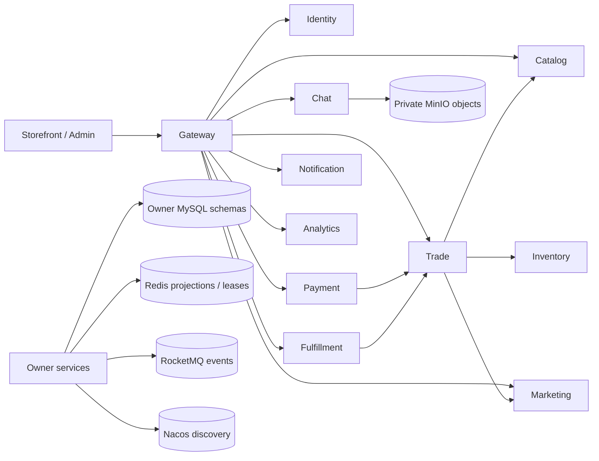

# PlainJournal 项目总计划

> 项目：素简记（PlainJournal）  
> 当前范围：M0-M8 单经营主体、自营 B2C 参考基线  
> 当前目标版本：`v1.0.4`，权威状态见[验证摘要](verification-summary.md)  
> 边界确认日期：2026-08-06

## 1. 项目定位

PlainJournal 以完整自营 B2C 交易链为业务载体，验证服务拆分以后出现的数据所有权、
结果未知、消息重复、多实例竞争、热点并发、故障恢复和数据扩展问题。

项目不以服务或中间件数量作为完成标准。核心目标是：

- 业务状态可以解释；
- 最终事实有明确所有者；
- 重试不会制造重复副作用；
- 中间件故障后可以降级、恢复和对账；
- 结论有自动化测试、真实基础设施和浏览器证据；
- 在声明的 16GB Windows 单机边界内可重复运行和清理。

当前仓库已经完成 M0-M8，是独立成立的参考基线，不是等待多商户能力补齐的 Basic
版本。多商户平台化进入独立
[PlainJournalPro](https://github.com/NoctilumeDev/PlainJournalPro)。

## 2. 产品边界

核心业务闭环：

```text
注册 / 登录
  -> 商品与营销
  -> 购物袋与结算
  -> 库存预占与下单
  -> 支付
  -> 仓库履约与物流
  -> 确认收货
  -> 评价 / 售后 / 退款
```

客服会话、站内信、邮件、搜索和运营统计围绕该主链提供辅助能力，但不能改变交易事实。

当前角色包括顾客、运营、客服、仓库、财务和超级管理员。完整功能与明确不做项见
[产品范围](01-product-scope.md)。

## 3. 架构基线

PlainJournal 使用 Spring Boot 3、JDK 17 和 Vue 3。后端包含 Gateway，以及 Identity、
Catalog、Inventory、Trade、Payment、Fulfillment、Marketing、Chat、Notification
和 Analytics 十个所有者服务。



主要设计入口：

- [服务架构](02-service-architecture.md)
- [核心状态机](03-core-state-machines.md)
- [数据所有权](04-data-ownership.md)
- [一致性策略](05-consistency-strategy.md)
- [技术版本矩阵](06-version-matrix.md)

## 4. 不变量

### 4.1 数据所有权

1. 服务只能写自己的 Schema，不共享 Mapper 或 Entity。
2. MySQL 保存订单、库存、支付、退款、履约和消息正文等最终事实。
3. Redis、OpenSearch、Analytics 汇总和其他投影必须可丢失、可重建。
4. Gateway 负责入口治理，不承载领域规则或访问业务数据库。

### 4.2 事务与一致性

1. 单服务内使用本地事务，不使用跨库大事务。
2. 业务更新和 Outbox 插入必须在同一本地事务中完成。
3. 消费幂等记录和业务副作用必须在同一本地事务中完成。
4. 超时只表示结果未知，调用方必须按稳定业务编号或幂等键查询恢复。
5. 库存、支付、退款、营销和履约状态只能通过各自状态机推进。
6. 补偿与对账必须由事实所有者授权，不允许治理接口直接改表。

### 4.3 降级

核心事实不可降级，一致性不可降级；搜索、缓存、附件、通知、聊天和可观测性可以在
明确边界内降级。统一规则见
[参考基线与 Pro 边界](reference-baseline-and-pro-boundary.md)。

## 5. M0-M8 结果

| 阶段 | 主题 | 当前结果 |
| --- | --- | --- |
| M0 | 分布式交易基线 | 身份、商品、库存、交易、支付和履约正向链建立 |
| M1 | 状态机与所有权 | 独立 Schema、服务账号、事件目录和所有者边界建立 |
| M2 | 失败与恢复 | Outbox、幂等消费、补偿、对账和结果未知恢复完成 |
| M3 | 多实例与发布 | 三实例竞争、租约、消费者竞争、滚动发布和版本边界完成 |
| M4 | 产品前端 | 顾客端、管理端、权限角色和正逆向业务旅程完成 |
| M5 | 容量与缓存 | 查询/写链基线、热点竞争、背压和 Redis 降级完成 |
| M6 | 秒杀 | Redis Lua 准入、异步排队、结果查询和最终库存核对完成 |
| M7 | 数据规模化 | 分布式 ID、读副本、分片、归档迁移和主动重分片完成 |
| M8 | 协作与内容 | Chat、通知、附件安全、GEO、评价、搜索和 Analytics 完成 |

详细实现不再重复写入本计划；终局结论见
[M0-M8 三层工程验收](evidence/m0-m8-three-layer-acceptance-20260728.md)，过程由 Git
历史追溯。

## 6. 验证方法

项目采用三层证据：

1. **代码与架构门禁**：类型、依赖边界、PMD、SpotBugs、覆盖率和供应链规则；
2. **自动化回归**：服务测试、前端单元/契约测试、Playwright 和生产构建；
3. **真实运行证据**：MySQL、Redis、Nacos、RocketMQ、MinIO、多实例、故障、容量、
   浏览器和 F12/CDP。

运行入口分为：

| 档位 | 证明对象 | 入口 |
| --- | --- | --- |
| UI Demo | 前端产品、主题和响应式交互 | `frontend/README.md` |
| Core Smoke | 真实核心交易与清理 | [Core Smoke](core-smoke.md) |
| Full Lab | 多实例、故障、容量、分片与专项恢复 | [验证索引](verification-index.md) |

控制变量、组合批次、随机种子、资源停止线、并发数字和一致性退出条件见
[参考基线与 Pro 边界](reference-baseline-and-pro-boundary.md)。当前测试数量、覆盖率、
真实中间件和容量事实只从[验证摘要](verification-summary.md)读取。

## 7. 单机资源原则

参考环境是 16GB Windows 单机。实验遵循：

- 按业务 Profile 分组启动，不为了形式完整一次启动全部服务；
- 代表服务最多使用三个实例验证竞争和发布边界；
- 中间件、读副本、分片、搜索、扫描和观测 Profile 按需串行；
- 启动前检查内存、端口、容器、代理和残留进程；
- 达到资源停止线后保存证据并停止升压；
- 每批结束确认数据、对象、进程、端口和容器已经清理。

项目证明的是机制和不变量在缩比环境中成立，不宣称复刻生产集群规模。

## 8. 当前冻结规则

`v1.0.x`：

- 只修复明确缺陷、安全问题、依赖风险和工程边界；
- 不增加大型业务域或为了展示技术而增加中间件；
- 发布必须通过 CI、Security、版本一致性和 Release 门禁；
- 精确版本与验证数字由机器可读基线生成。

后续前端视觉版本：

- 可以调整设计令牌、布局、密度、动效、组件和响应式体验；
- 不得改变最终事实所有者、接口语义、权限边界和交易状态机；
- 视觉修改仍需通过类型、单元/契约、E2E、构建和浏览器检查。

## 9. PlainJournalPro

PlainJournalPro 负责 M9 及以后：

- Merchant、Shop、商户子账号和经营主体所有权；
- 跨店购物车、父订单、店铺子订单和独立履约责任；
- 平台优惠、店铺优惠、补贴和资金承担方分摊；
- 平台账本、手续费、佣金、商户结算和逆向冲正；
- 跨商户权限隔离、对账、故障恢复和容量验证；
- Java 交易核心与有明确职责的 Go 服务协作。

Pro 使用独立仓库、Issue、发布和 Git 历史。它以 PlainJournal 的不变量和验证方法为
控制组，但多商户所有权、订单、履约、售后和资金模型必须重新设计。详细边界见
[参考基线与 Pro 边界](reference-baseline-and-pro-boundary.md)。

## 10. 文档治理

现行规范位于 `docs/` 根目录：

- `00-06`：项目、产品、架构、状态机、所有权、一致性和版本；
- `07-09`：本地网络、身份安全和 Redis 降级；
- `10-16`：领域服务设计；
- `17-25`：技术采纳、观测、补偿、对账、韧性和追踪；
- 非编号入口：验证摘要、验证索引、项目历史、Core Smoke 和项目边界。

逐批实施报告不再随主分支持续携带，历史版本由 Git 保存。`docs/evidence/` 只保留
少量终局验收快照，不承担当前版本号、测试数或覆盖率的事实源。

文档变更必须通过：

```bash
node tools/render-verification-summary.mjs --check
node tools/check-markdown-links.mjs
git diff --check
```

涉及最终事实所有者、跨服务同步依赖、交易状态机、多商户边界或发布策略的变化，必须
同步更新本计划或新增 ADR。
