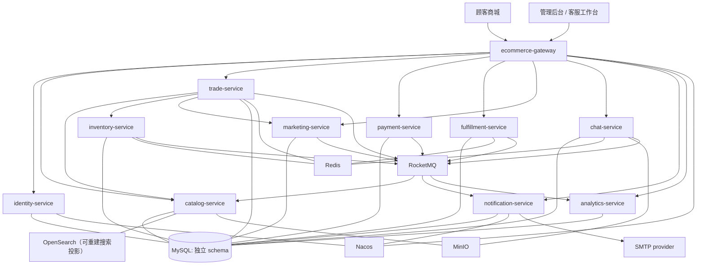

# 服务架构

## 1. 总体结构



## 2. 服务职责

| 服务 | 默认端口 | 单一职责 | 不负责 |
| --- | ---: | --- | --- |
| `ecommerce-gateway` | `18000` | 路由、鉴权前置、限流、请求追踪 | 业务规则、数据库访问 |
| `identity-service` | `18101` | 顾客与员工账号、地址、RBAC、令牌和登录风控 | 订单、客服消息 |
| `catalog-service` | `18102` | 类目、品牌、SPU、SKU、价格、上下架、商品媒体、商品评价和可重建搜索投影 | 库存数量、订单价格快照；把 OpenSearch 当最终事实 |
| `inventory-service` | `18103` | 仓库、现货、预占、释放、确认扣减和库存流水 | 商品营销价格、订单状态 |
| `trade-service` | `18104` | 购物车、结算、订单、订单快照、取消、收货和售后申请 | 支付渠道流水、物理库存直接更新 |
| `payment-service` | `18105` | 支付单、渠道请求、回调、退款和对账 | 擅自修改订单、库存 |
| `fulfillment-service` | `18106` | 拣货、包裹、发货、运单、追加式物流轨迹、MySQL 空间位置投影、Redis GEO 加速和退货收货 | 支付结果判定、用 Redis 裁决物流事实 |
| `marketing-service` | `18107` | 优惠券、活动、优惠计算和秒杀资格 | 最终支付金额持久化、最终库存 |
| `chat-service` | `18108` | 会话、可靠消息、客户端幂等、多节点实时路由、离线回放、附件安全和客服认领 | 直接查询订单或用户数据库；未扫描就放行附件 |
| `notification-service` | `18109` | 站内信、邮件偏好、可靠邮件投递、消费失败和审计恢复 | 决定订单状态；把 SMTP 接受解释为交易成功 |
| `analytics-service` | `18110` | Trade/Payment 事件日志、日/商品汇总、对账、审计重建和运营总览 | 跨服务 JOIN；修改订单、支付或履约事实；估算缺失收入 |

管理后台是客户端，不再单独创建一个包含全部业务的 `admin-service`。后台请求通过网关进入对应领域服务。

## 3. 同步与异步边界

同步调用只用于用户必须立即知道结果的短链路：

- 订单结算时查询 SKU 当前状态和价格。
- 创建订单时请求库存预占。
- 使用优惠券时请求营销服务计算并核销资格。
- 客服绑定订单时校验顾客是否有权查看该订单。
- 顾客查询或提交评价只读取 Catalog 的本地评价资格投影，不在请求链上同步调用
  Trade。

异步事件用于跨服务状态推进：

- 支付成功、支付失败和退款结果。
- 订单取消、超时关闭和确认收货。
- 库存预占、释放、确认扣减和低库存告警。
- 发货、物流节点和签收。
- Trade 发布带不可变订单行快照的 `OrderCompleted`，Catalog 幂等生成评价资格。
- Catalog 商品事务只提交 MySQL 事实和同库搜索 Outbox；后台任务再把当前权威状态
  投影到 OpenSearch。搜索结果回读 MySQL，索引不可用时明确退化为基础匹配。
- Trade/Payment 已发生事实由 Analytics 异步消费并写入自己的来源事件日志和汇总；
  管理端不在请求链上同步聚合多个服务。
- 聊天持久化事件、跨节点定向投递与各类通知。

禁止形成同步调用环。例如 `trade -> payment -> trade` 必须改为 `trade -> payment` 创建支付单，支付结果通过事件返回。

## 4. 分阶段启动

考虑本机 16 GB 内存，应用服务按配置组运行：

| 配置组 | 服务 |
| --- | --- |
| `foundation` | gateway、identity、catalog、inventory、trade |
| `transaction` | payment、fulfillment |
| `collaboration` | chat、notification |
| `operations` | analytics（按需启动，消费事件并提供管理端运营读模型） |
| `campaign` | marketing、秒杀相关压测组件 |

开发某条链路时只启动有关服务。代表性全链路验收也必须遵守资源预算，不要求所有服务
同时扩为多实例。

## 5. 当前代码目录

```text
PlainJournal/
├── backend/
│   ├── platform-common/          # 仅技术能力，不放业务 Entity
│   ├── ecommerce-gateway/
│   └── services/
│       ├── identity-service/
│       ├── catalog-service/
│       ├── inventory-service/
│       ├── trade-service/
│       ├── payment-service/
│       ├── fulfillment-service/
│       ├── marketing-service/
│       ├── chat-service/
│       ├── notification-service/
│       └── analytics-service/
├── frontend/
│   ├── storefront-web/
│   └── admin-web/
├── deploy/
└── docs/
```

每个服务内部采用 `interfaces -> application/domain <- infrastructure` 的轻量 DDD 分层。
接口适配器不得反向依赖基础设施，通常经应用入口协作，也可以使用稳定的领域值类型完成
输入转换；领域层不依赖 Spring 或持久化框架。需要替换实现、隔离故障或跨越进程的能力
使用应用端口。现有复杂事务仍允许 application service 协调本服务的持久化组件，不把
项目描述成纯六边形架构，也不为简单 CRUD 制造无业务价值的空接口。

## 6. 关键约束

- 服务只能写自己的 schema，不能跨库 JOIN 或直接调用别人的 Mapper。
- 对外契约使用请求/响应 DTO 和事件 DTO，禁止共享数据库 Entity。
- `platform-common` 只允许放统一异常、日志追踪、鉴权上下文、序列化和测试基础设施。
- 任何跨服务重试都必须以幂等键为前提。
- 后台“超级管理员”可以发起授权操作，但不能绕过领域状态机直接改表。

仓库门禁会拒绝接口层反向导入基础设施、应用端口导入基础设施、Controller 声明事务、
领域层导入框架、跨服务源码依赖，以及 Java/SQL/XML/YAML 中出现其他服务 schema。

## 7. 修改影响面

任何修改先确定所有者和影响面，再决定验证范围：

| 修改位置 | 必须核对 | 最小验证 |
| --- | --- | --- |
| 接口、DTO、事件 | 调用方、版本兼容、鉴权、错误语义 | 契约测试和对应真实链路 |
| application/domain | 状态机、事务边界、幂等、不变量 | 所有者服务测试和数据库事实核对 |
| infrastructure | 超时、重试、降级、恢复、资源释放 | 真实依赖故障与恢复脚本 |
| schema/迁移 | 数据所有权、索引、锁、回滚与历史兼容 | MySQL 迁移及并发场景 |
| `platform-common` 或网关 | 全部消费者、信任边界、默认行为 | 后端全量回归及代表浏览器链路 |

共享改动不能只凭局部单测放行；场景脚本继续拥有其启动、证据和清理职责，避免把所有
脚本抽进一个高耦合公共编排层。
