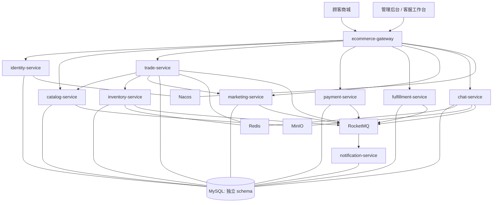

# 服务架构

## 1. 总体结构



## 2. 服务职责

| 服务 | 单一职责 | 不负责 |
| --- | --- | --- |
| `ecommerce-gateway` | 路由、鉴权前置、限流、请求追踪 | 业务规则、数据库访问 |
| `identity-service` | 顾客与员工账号、地址、RBAC、令牌和登录风控 | 订单、客服消息 |
| `catalog-service` | 类目、品牌、SPU、SKU、价格、上下架、商品媒体和商品评价 | 库存数量、订单价格快照 |
| `inventory-service` | 仓库、现货、预占、释放、确认扣减和库存流水 | 商品营销价格、订单状态 |
| `trade-service` | 购物车、结算、订单、订单快照、取消、收货和售后申请 | 支付渠道流水、物理库存直接更新 |
| `payment-service` | 支付单、渠道请求、回调、退款和对账 | 擅自修改订单、库存 |
| `fulfillment-service` | 拣货、包裹、发货、运单、物流轨迹和退货收货 | 支付结果判定 |
| `marketing-service` | 优惠券、活动、优惠计算和秒杀资格 | 最终支付金额持久化、最终库存 |
| `chat-service` | 会话、消息、已读回执、在线路由和附件引用 | 直接查询订单或用户数据库 |
| `notification-service` | 站内信、邮件任务、模板、重试和发送记录 | 决定订单业务状态 |

管理后台是客户端，不再单独创建一个包含全部业务的 `admin-service`。后台请求通过网关进入对应领域服务。

## 3. 同步与异步边界

同步调用只用于用户必须立即知道结果的短链路：

- 订单结算时查询 SKU 当前状态和价格。
- 创建订单时请求库存预占。
- 使用优惠券时请求营销服务计算并核销资格。
- 客服绑定订单时校验顾客是否有权查看该订单。
- 发布评价前校验已完成订单，并通过订单完成事件维护可评价凭据。

异步事件用于跨服务状态推进：

- 支付成功、支付失败和退款结果。
- 订单取消、超时关闭和确认收货。
- 库存预占、释放、确认扣减和低库存告警。
- 发货、物流节点和签收。
- 聊天离线投递与各类通知。

禁止形成同步调用环。例如 `trade -> payment -> trade` 必须改为 `trade -> payment` 创建支付单，支付结果通过事件返回。

## 4. 分阶段启动

考虑本机 16 GB 内存，应用服务按配置组运行：

| 配置组 | 服务 |
| --- | --- |
| `foundation` | gateway、identity、catalog、inventory、trade（当前已实现） |
| `transaction` | payment、fulfillment |
| `collaboration` | chat、notification |
| `campaign` | marketing、秒杀相关压测组件 |

开发某条链路时只启动有关服务。完整联调和演示再启动全部应用服务。

## 5. 未来代码目录

```text
ecommerce-platform/
├── backend/
│   ├── platform-bom/
│   ├── platform-common/          # 仅技术能力，不放业务 Entity
│   ├── ecommerce-gateway/
│   └── services/
│       ├── identity-service/
│       ├── catalog-service/
│       ├── inventory-service/
│       ├── trade-service/
│       ├── payment-service/
│       ├── fulfillment-service/
│       ├── marketing-service/
│       ├── chat-service/
│       └── notification-service/
├── frontend/
│   ├── storefront-web/
│   └── admin-web/
├── deploy/
└── docs/
```

每个服务内部采用 `interfaces -> application -> domain -> infrastructure` 的轻量 DDD 分层。简单 CRUD 可以由 application service 直接协调仓储，不为形式制造大量空接口。

## 6. 关键约束

- 服务只能写自己的 schema，不能跨库 JOIN 或直接调用别人的 Mapper。
- 对外契约使用请求/响应 DTO 和事件 DTO，禁止共享数据库 Entity。
- `platform-common` 只允许放统一异常、日志追踪、鉴权上下文、序列化和测试基础设施。
- 任何跨服务重试都必须以幂等键为前提。
- 后台“超级管理员”可以发起授权操作，但不能绕过领域状态机直接改表。
