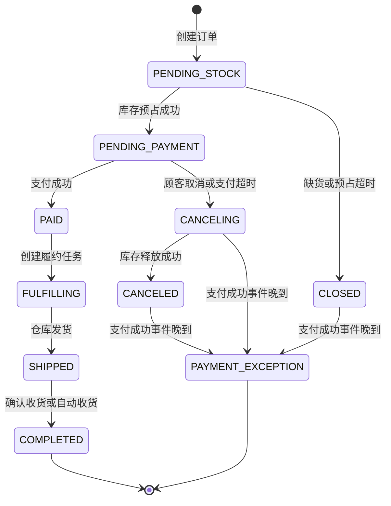
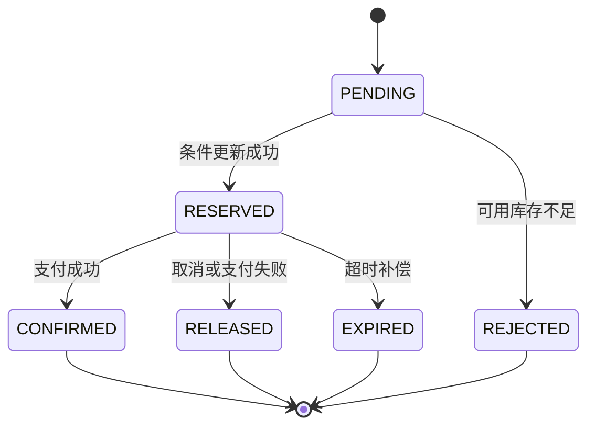
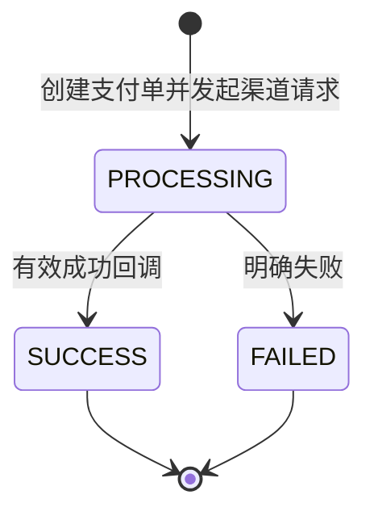
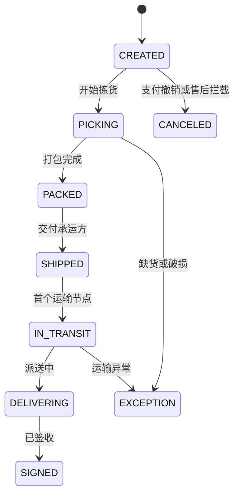
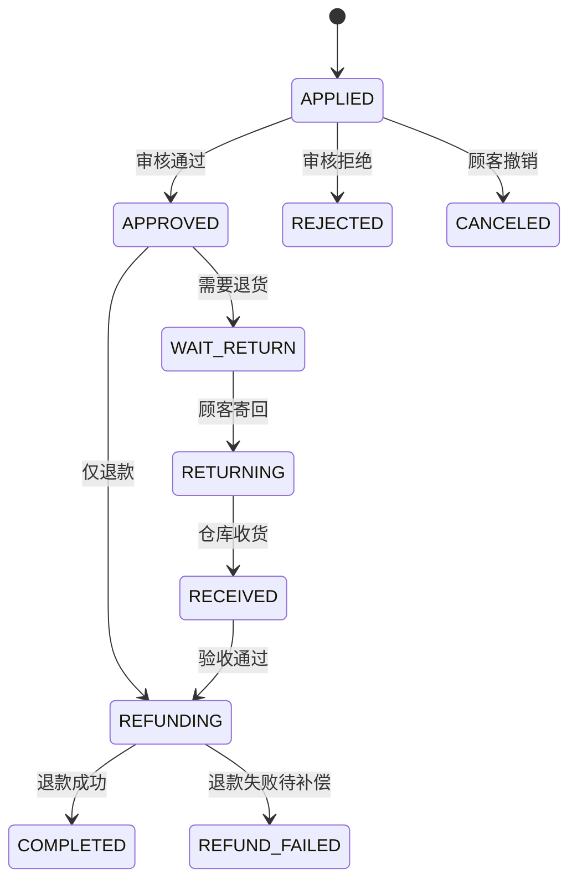

# 核心状态机

状态只能通过明确命令迁移。Controller 不直接写状态字段，后台也不能通过通用更新接口任意指定状态。

## 1. 订单状态



约束：

- `PAID` 之后不能通过取消订单释放库存，必须走售后。
- 售后状态单独维护，不能把订单在 `PAID`、`SHIPPED` 与“退款中”之间来回改。
- 每次迁移写入 `order_status_history`，携带操作者、命令、旧状态和新状态。
- `PENDING_STOCK` 与 `CANCELING` 是可恢复中间态；远程库存调用失败时保留状态并由定时任务重试。
- 支付超时复用 `CANCELING -> CANCELED`，不能只改订单状态而遗漏库存释放。
- 取消或关闭后才到达的支付成功事实进入 `PAYMENT_EXCEPTION` 并发布复核事件，不发布 `OrderPaid`；后续退款服务或人工处理，库存保持已释放。

## 2. 库存预占状态



库存恒等式：

```text
available = on_hand - reserved
```

确认扣减时同时减少 `on_hand` 和 `reserved`；释放时只减少 `reserved`。所有操作以 `reservation_no` 幂等。

## 3. 支付与退款状态



当前切片实现 `PROCESSING / SUCCESS / FAILED`；支付关闭、退款和对账在后续切片增加，不能假装已经具备。退款将使用独立状态机：`INIT -> PROCESSING -> SUCCESS / FAILED`。支付成功和退款成功都是终态事实，不允许被普通更新接口覆盖。渠道回调日志与状态迁移均在本地事务边界内处理。

## 4. 履约与物流状态



物流轨迹采用追加写入，不覆盖历史节点。坐标只代表最近一次有效上报，不能替代物流业务节点。

## 5. 售后状态



退货入库与退款是两个事实，先后顺序由售后类型决定。任何失败都保留可恢复状态和操作记录。

## 6. 聊天消息状态

```text
CREATED -> STORED -> DISPATCHED -> DELIVERED -> READ
                         \-> OFFLINE
```

- `STORED` 表示消息已持久化，才可向发送方确认成功。
- 在线推送失败不回滚消息，转为离线待投递。
- 客户端使用 `client_message_id` 防止断线重发产生重复消息。
