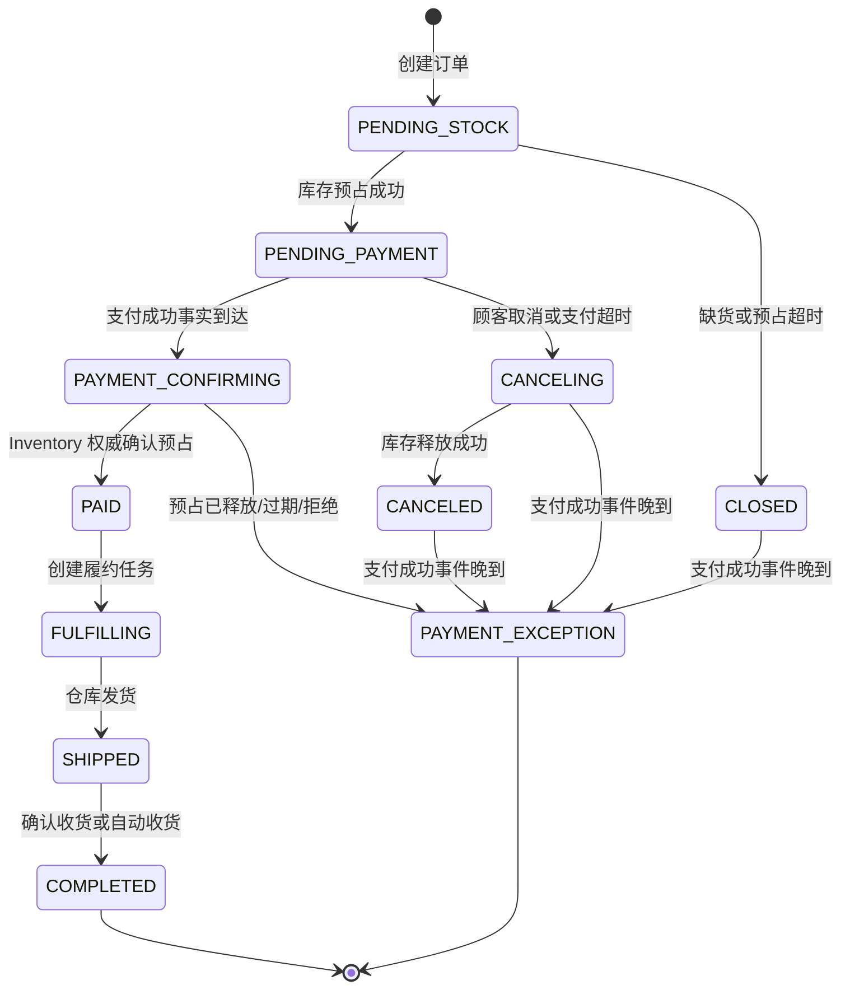
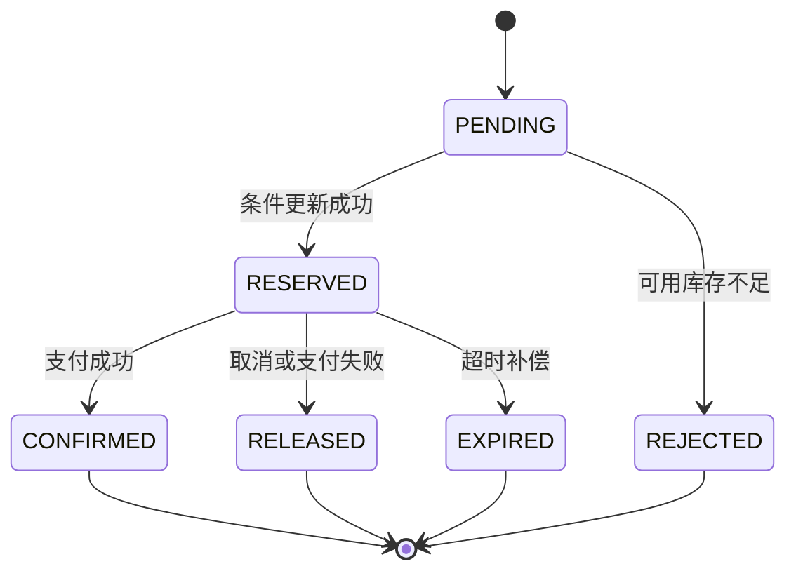
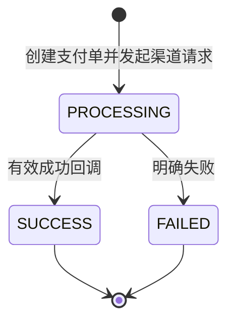
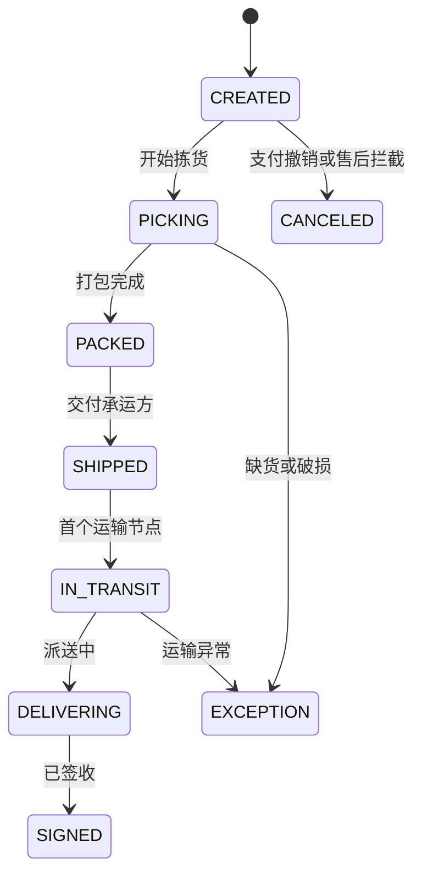
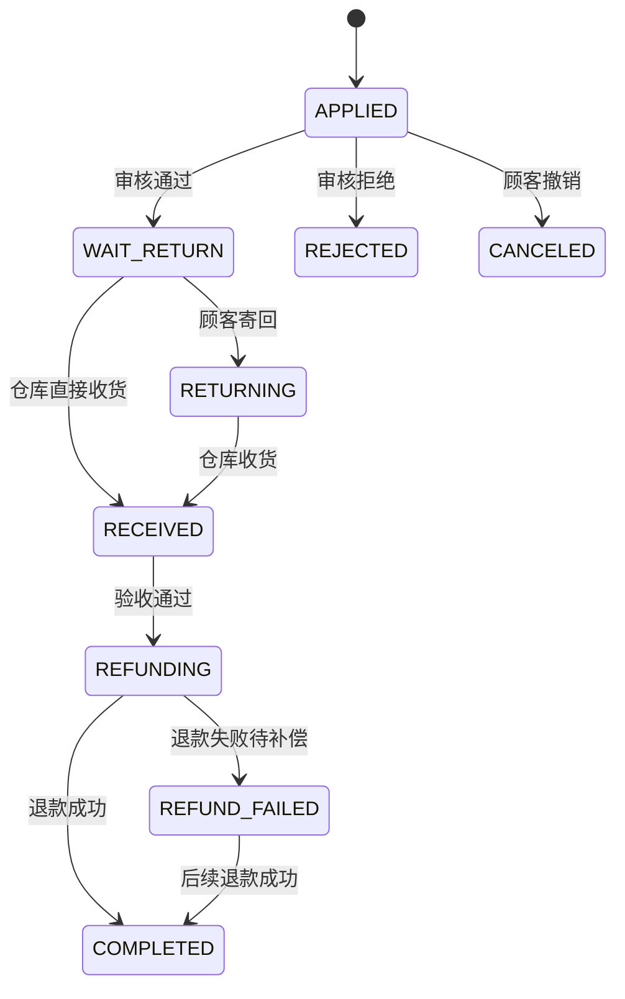

# 核心状态机

状态只能通过明确命令迁移。Controller 不直接写状态字段，后台也不能通过通用更新接口任意指定状态。

## 1. 订单状态



约束：

- `PAID` 之后不能通过取消订单释放库存，必须走售后。
- 售后状态单独维护，不能把订单在 `PAID`、`SHIPPED` 与“退款中”之间来回改。
- 每次迁移写入 `order_status_history`，携带操作者、命令、旧状态和新状态。
- `PENDING_STOCK`、`CANCELING` 与 `PAYMENT_CONFIRMING` 是可恢复中间态；远程库存调用失败时保留状态并由定时任务重试。
- 支付成功不直接等于订单 `PAID`。只有 Inventory MySQL 权威预占为 `CONFIRMED`
  才能生成 `OrderPaid`；确认响应和查询均未知时停留在 `PAYMENT_CONFIRMING`。
- 支付超时复用 `CANCELING -> CANCELED`，不能只改订单状态而遗漏库存释放。
- 取消或关闭后才到达的支付成功事实进入 `PAYMENT_EXCEPTION` 并发布复核事件，不发布 `OrderPaid`；后续退款服务或人工处理，库存保持已释放。

## 2. 库存预占状态



库存恒等式：

```text
available = on_hand - reserved
```

确认扣减时同时减少 `on_hand` 和 `reserved`；释放时只减少 `reserved`。所有操作以 `reservation_no` 幂等。

## 3. 支付与退款状态



支付单和退款单各自维护 `PROCESSING / SUCCESS / FAILED`。退款接到明确失败回调后可以在同一退款业务号下重新发起，并由后续有效成功回调执行 `FAILED -> SUCCESS`；退款成功不可被晚到的失败事件覆盖。支付成功和退款成功都是终态事实，不允许被普通更新接口覆盖。渠道回调日志与状态迁移均在本地事务边界内处理。

退款渠道请求另有投递状态：

```text
PENDING -> REQUESTING -> SENT
    ^           |
    |           +-> PENDING（传输失败，有限重试）
    +--------------- NEEDS_ATTENTION（达到阈值，人工重投）
```

渠道请求 `SENT` 只表示请求已交给渠道，不表示退款成功；只有独立验签回调可以写入 `SUCCESS`。

人工补偿只允许 `PROCESSING/NEEDS_ATTENTION -> PROCESSING/PENDING`，或在渠道明确失败并已调查后执行 `FAILED/SENT -> PROCESSING/PENDING`。`PENDING`、`REQUESTING`、结果未知的 `PROCESSING/SENT` 和 `SUCCESS` 均拒绝新重投；每次有效管理员命令都有幂等键和追加式审计。

## 4. 履约与物流状态



物流轨迹采用追加写入，不覆盖历史节点。坐标只代表最近一次有效上报，不能替代物流业务节点。

`shipment_latest_position` 是履约 MySQL 内的投影，不是另一套履约状态机：带坐标轨迹
写入时按 `occurred_at`、再按 `trace_id` 选择最新事实。Redis GEO 只缓存同一最新位置，
写入发生在本地事务提交后；缓存丢失或不可用时读取回退 MySQL，附近查询始终由 MySQL
空间索引裁决。

## 5. 售后状态



首版只支持整单退货退款：完成订单须在配置的申请期限内发起，同一订单最多一笔售后。退货入库与退款是两个独立事实；库存已经回补而退款暂时失败时，不反向扣减库存。重复事件和成功后的晚到失败事件均按幂等或过时消息处理。

## 6. 聊天消息状态

```text
CREATED -> STORED -> DISPATCHED -> DELIVERED -> READ
```

接收方回执状态：

```text
OFFLINE -> DELIVERED -> READ
```

- `STORED` 表示消息已持久化，才可向发送方确认成功。
- `DISPATCHED` 表示 Broker 已确认接收持久化事件，不表示用户在线。
- 在线推送失败不回滚消息，也不伪造 `DELIVERED`；接收方回执保持 `OFFLINE`。
- 客户端使用 `client_message_id` 防止断线重发产生重复消息。
- M8.1 已实现到 `STORED`：消息与 `ChatMessageStored` Outbox 同事务提交，
  会话行锁分配单调 `message_sequence`，顺序重试和并发重试都返回同一消息。
- M8.2 已实现 `DISPATCHED`、`DELIVERED`、`READ` 与独立回执状态：
  Outbox 只有 Broker ACK 后推进；至少一个本地 WebSocket 会话写入成功后才写
  `DELIVERED`；可靠 REST 已读命令单调推进到 `READ`。
- 用户无在线节点或目标节点退出时，消息可以保持 `DISPATCHED`，回执保持
  `OFFLINE`；重连后从 MySQL 回放。
- MQ 重投和同一用户多会话可能带来重复帧，客户端按 `messageId` 去重，数据库状态
  只能单调推进。

## 7. 聊天附件上传状态

```text
PENDING -> SCAN_PENDING -> SCANNING -> READY -> ATTACHED
                            |            |
                            |            +-> INFECTED
                            +-> SCAN_RETRY -> SCANNING
                            +-> SCAN_NEEDS_ATTENTION

SCAN_NEEDS_ATTENTION
  -> 管理员幂等审计重扫
  -> SCAN_PENDING

PENDING / SCAN_PENDING / SCAN_RETRY / SCAN_NEEDS_ATTENTION / INFECTED / READY
  -> CLEANING -> DELETED
       |
       +-> CLEANUP_PENDING -> CLEANING
```

- `PENDING` 表示上传意图已保存，但对象尚未通过真实 MinIO 校验。
- `SCAN_PENDING` 表示大小、MIME、文件头和完整 SHA-256 已确认，等待恶意文件扫描。
- `SCANNING` 由一个实例持有有期限租约；扫描在数据库事务外流式读取对象。
- `READY` 只表示真实扫描结果为洁净，尚未绑定消息。
- `INFECTED` 保存扫描引擎和恶意签名，禁止绑定。
- `SCAN_RETRY` 保存依赖或协议错误并有限重试；达到上限后进入
  `SCAN_NEEDS_ATTENTION`，自动任务停止推进。
- `SCAN_NEEDS_ATTENTION` 只能通过 `ADMIN/OPERATOR` 幂等、带原因和追加式审计的
  命令重置为 `SCAN_PENDING`；命令不能直接写 `READY`。
- `ATTACHED` 只能在消息本地事务内写入；同一上传意图不能绑定第二条消息。
- 过期且未绑定的各上传/扫描状态由清理任务抢占为 `CLEANING`，删除失败进入
  `CLEANUP_PENDING`，后续继续重试。
- 陈旧 `CLEANING` 可在恢复窗口后被其他实例重新抢占；MinIO 删除幂等，MySQL 状态
  是清理结果的最终裁决。

## 8. 通知与邮件投递状态

站内信状态：

```text
UNREAD -> READ
```

- `notification_task` 是一个来源事件对应的通知事实，`source_event_id` 唯一。
- `in_app_notification` 按用户保存 `UNREAD / READ`，重复已读命令保持 `READ`。
- SMTP 故障不回滚已经提交的站内信，也不改变支付、退款或履约状态。

邮件投递状态：

```text
PENDING -> SENDING -> SENT
              |
              +-> RETRY -> SENDING
              |
              +-> NEEDS_ATTENTION

NEEDS_ATTENTION
  -> 管理员幂等审计命令
  -> RETRY
```

- `PENDING / RETRY` 由一个实例使用 MySQL 条件更新和有期限租约抢占为 `SENDING`，
  SMTP 调用发生在数据库事务外。
- 每次抢占先增加尝试次数；失败未达到上限时进入 `RETRY`，达到上限后进入
  `NEEDS_ATTENTION`，自动任务停止推进。
- 顾客不能恢复邮件任务；`ADMIN/OPERATOR` 必须提供稳定 `commandId` 和原因，命令
  只允许 `NEEDS_ATTENTION -> RETRY`，不能直接写 `SENT`。
- 相同恢复命令只追加一条 `notification_delivery_retry_audit`；命令与状态重置在
  Notification 本地事务内完成。
- 每个邮件任务持久化稳定 `provider_message_id`。SMTP 已接受邮件但响应丢失时，
  重试可能造成重复邮件；稳定 `Message-ID` 便于供应商或收件系统去重，但本项目
  不宣称 SMTP exactly-once。
- 只有 SMTP 客户端明确返回成功后才写 `SENT`；超时或连接失败不能伪造成功。
