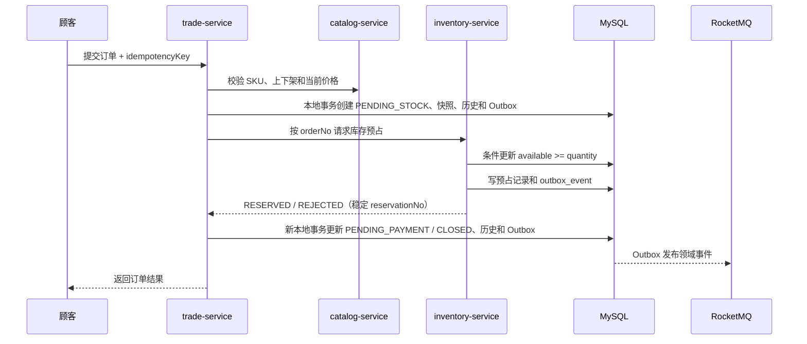

# 分布式一致性与高并发策略

## 1. 基本原则

1. 单服务内使用本地数据库事务。
2. 跨服务不使用跨库事务，采用状态机、Outbox、幂等消费和补偿任务。
3. MySQL 是订单、支付、库存和退款的最终事实。
4. Redis 负责缓存、准入和短期协调，不承担最终库存。
5. MQ 允许重复投递，所有消费者必须先设计幂等再消费。

## 2. 普通下单流程



库存更新必须由一条带条件的 SQL 完成，不能先查询再扣减。`order_no + sku_id` 或独立 `reservation_no` 建唯一索引。

如果库存预占成功但交易服务没有收到响应，交易服务按 `reservation_no` 查询结果，不能直接重复创建另一条预占。

当前实现不会把目录或库存 HTTP 调用包进交易数据库事务。远程服务不可用时订单保留在 `PENDING_STOCK`，恢复任务按相同预占号重试；取消时先进入 `CANCELING`，库存释放成功后才进入 `CANCELED`。

## 3. 支付与订单推进

- 支付服务先保存原始回调和渠道流水，唯一索引拦截重复回调。
- 本地事务内把支付单改为 `SUCCESS` 并写入 `outbox_event`。
- `trade-service` 消费 `PaymentSucceeded`，在第一个本地事务写 `consumed_event` 并把订单迁移到 `PAYMENT_CONFIRMING`；提交后才以原预占号调用 Inventory。
- Inventory 通过 MySQL 所有者域状态机幂等确认预占；Trade 只有读取到权威 `CONFIRMED`，才在第二个本地事务迁移 `PAID` 并写 `OrderPaid` Outbox。确认响应丢失时先按预占号查询，仍未知则保留恢复时间，不伪造成功。
- `EXPIRED/RELEASED/REJECTED` 不生成 `OrderPaid`，而是进入 `PAYMENT_EXCEPTION` 等待授权复核。
- 这条事件链使资金成功事实先被保留，同时避免在库存最终裁决未知时提前创建履约或核销权益。
- 后续 `fulfillment-service` 同样消费 `OrderPaid` 创建履约单，不直接消费渠道回调。

## 4. Outbox 与消费幂等

事件生产：

```text
业务表更新 + outbox_event 插入 = 同一个本地事务
后台发布器发送 MQ -> 成功后标记 published
定时任务重试超时未发布事件
```

事件信封至少包含：

```text
eventId, eventType, aggregateType, aggregateId, aggregateVersion,
occurredAt, producer, traceId, payloadVersion, payload
```

事件消费：

- `consumed_event(event_id, consumer_group)` 建联合唯一索引。
- 幂等记录与业务副作用必须在同一个本地事务中提交。
- 失败按退避策略重试；超过阈值进入死信/人工补偿列表。
- M1 售后链路的消费者强制校验 `payloadVersion = 1`。每次失败把消息 ID、消费组、原始报文、投递次数和错误写入本服务 `consumer_failure`；达到阈值后状态变为 `NEEDS_ATTENTION` 并确认 MQ 消息，避免毒丸永久占用队列。后续成功重放标记为 `RECOVERED`。
- Trade、Inventory、Payment、Fulfillment 各自从本服务 `consumer_failure` 提供 `ADMIN` 专用只读摘要和有界活动列表，并统一暴露活动数量、最老未恢复年龄和状态转换指标。只读响应不包含 `raw_payload`；后续重放必须回到领域服务执行权限、幂等和审计，不允许中央工作台跨库修改状态。
- Payment 已实现首个领域授权补偿命令：退款派发只有处于明确可恢复状态才可由 `ADMIN` 重试，命令键、操作者、原因、状态前后值和最后失败摘要与状态变更在同一本地事务写入追加式审计。同一键重复请求不重复执行，并发命令通过退款行锁串行化；该命令不能写入退款成功。

## 4.1 整单退货退款

```text
Trade 审核通过 -> Outbox: AfterSaleApproved
Fulfillment 寄回/收货/验收 -> Outbox: ReturnInspected
Inventory 按 afterSaleNo 幂等回补 -> Outbox: ReturnStocked
Trade 读取订单价格分摊快照 -> Outbox: RefundRequested
Payment 以 afterSaleNo 幂等建退款单 -> 持久化渠道投递任务
渠道独立验签回调 -> Outbox: RefundSucceeded / RefundFailed
Trade 消费明确成功事实 -> 售后 COMPLETED
```

- 退款金额只读取订单创建时的实付与商品行优惠分摊，不重新运行营销规则。
- 退货库存流水和渠道退款是两个独立事实；退款失败不撤销已经验收的退货入库。
- 渠道传输失败时退款保持 `PROCESSING`，投递任务采用原退款号重试；进程在渠道接受后、落库前退出时允许幂等重发。
- 同一渠道退款号的 `FAILED -> SUCCESS` 更新同一渠道事务记录，回调日志保留每个外部事件。
- Trade 在售后已完成后收到晚到的 `RefundFailed` 时，将其作为过时事件消费，不回退成功事实。
- 自动派发耗尽或渠道明确失败后的人工恢复只重置为 `PROCESSING/PENDING`；渠道结果未知的 `SENT` 拒绝重投。完整契约见 [领域授权补偿与审计](19-compensation-governance.md)。

## 5. 订单超时与库存释放

- 创建待支付订单时发送延迟消息。
- 延迟消息到达后再次读取订单当前状态，只有 `PENDING_PAYMENT` 才关闭。
- 关闭订单写 Outbox，库存服务消费后按预占号释放。
- 定时扫描作为兜底，不能只依赖一条延迟消息。
- 支付成功与超时关闭竞争时，以数据库条件更新决定唯一胜者，失败方重新读取最终状态。

## 6. 秒杀专用链路

秒杀属于第二阶段，不复用普通下单接口硬扛流量：

1. 网关限流、设备与账号风控。
2. Redis Lua 原子校验活动、用户资格和剩余准入量。
3. 成功请求写 RocketMQ，前端轮询结果。
4. 消费者按业务幂等键创建订单并请求 MySQL 最终预占。
5. Redis 与 MySQL 不一致时以 MySQL 为准，并通过对账任务修正 Redis。

Redis 不可用时秒杀入口直接降级为“活动繁忙”，不能穿透到 MySQL；普通下单仍可走数据库条件扣减。

## 7. 聊天与物流

### 聊天

- 消息先写 MySQL 和 Outbox，再确认发送成功。
- Redis 只保存带 TTL 的在线状态和 WebSocket 节点路由；未读事实由 MySQL 计算。
- `ChatMessageStored` 使用 `ecommerce-chat-events`，节点定向事件使用
  `ecommerce-chat-delivery-events`；MQ 故障时消息仍保留，稍后补发。
- `conversation_id + sender_id + client_message_id` 唯一，解决断线重发。
- M8.1 已完成第一条和唯一约束：会话行 `FOR UPDATE` 后分配消息序号，消息、
  回执初态和 Outbox 在一个本地事务内提交；Outbox 事件不复制私聊正文。
- M8.2 已完成 Outbox 多实例租约、Broker ACK 后推进、共享 Dispatcher、
  Redis presence、节点 Tag 定向消费、JWT WebSocket、节点退出转离线和 MySQL
  回放。无在线节点时消息保持 `DISPATCHED`、接收方回执保持 `OFFLINE`。
- Broker ACK 后数据库更新失败允许重复发布；客户端按 `messageId` 去重，服务端状态
  单调推进，不承诺 WebSocket exactly-once。
- Redis 在握手时不可用则关闭连接；Dispatcher 查询 Redis 失败时先把失败事实和
  `next_attempt_at` 持久化到 MySQL，再 ACK 原消息，由租约作业恢复；心跳失败后
  路由按 TTL 过期。任何 Redis 故障都不改变 MySQL 消息事实。
- M8.4 允许浏览器使用长期 JWT 调用受保护 REST API 换取短期不透明票据；票据绑定
  环境、用户、角色、`/ws/chat` 路径和过期时间，响应禁止缓存。
- Redis Key 只使用票据 SHA-256 摘要，原始 bearer 不落 Redis；Lua 原子
  `GET + DEL` 保证多个 Chat 实例最多一个消费成功。重放、过期、重复查询参数和路径
  不匹配均拒绝，Redis 不可用时签发与握手都失败关闭。
- 能设置 Authorization Header 的原有 WebSocket 客户端继续直接使用 JWT；长期 JWT
  不进入普通查询参数。
- M8.5 已为 `ChatMessageStored` 和 `ChatDeliveryRequested` 增加 Chat 专属
  `consumer_failure` 台账。无效契约在失败事实落库后进入 `NEEDS_ATTENTION` 并
  ACK；临时处理失败进入 `RETRYING`，持久化成功后 ACK 原消息；MySQL 租约作业
  有限重试，达到预算后转 `NEEDS_ATTENTION`，成功后转为 `RECOVERED`。
- WebSocket 目标离线是可恢复业务结果，不记消费失败；Redis presence 查询失败属于
  临时依赖故障，不能把源事件解释为已成功分发。
- Chat 的 `/actuator/consumerfailures` 仅允许 `ADMIN` 只读访问，返回有界活动摘要但
  不返回 `raw_payload`；Prometheus 暴露活动数、最老未恢复年龄和状态转换指标。
  当前没有直接改成功状态的运维接口；如果后续增加人工恢复，仍必须回到 Chat
  领域权限、幂等和审计边界。
- M8.3 使用
  `conversation_id + uploader_id + client_upload_id` 唯一约束收敛上传意图重试；
  真实对象通过大小、MIME、文件头和完整 SHA-256 校验后只进入 `SCAN_PENDING`。
- M8.7 扫描任务在短事务内通过状态、租约和 `scan_claim_owner` 抢占，随后在事务外
  流式读取 MinIO 并调用 ClamAV。扫描内容的大小和 SHA-256 必须与确认快照一致；
  只有真实洁净结果才能进入 `READY`，恶意签名进入 `INFECTED`。
- 扫描依赖故障进入 `SCAN_RETRY` 并有限重试，达到上限进入
  `SCAN_NEEDS_ATTENTION`。管理员恢复命令必须有角色、稳定命令 ID、原因和追加式
  审计，只能重置为 `SCAN_PENDING`，不能直接写成功。
- 附件消息在一个 MySQL 本地事务内写入 `chat_message + chat_attachment` 并把上传
  意图推进为 `ATTACHED`；事务内不调用 MinIO，同一上传意图不能绑定第二条消息。
- 下载前重新校验会话成员和对象 SHA-256；过期孤儿对象通过
  `CLEANING/CLEANUP_PENDING/DELETED` 抢占状态机有限重试，MySQL 保存最终清理事实。

### 通知

- M8.8 的 Notification 消费 `PaymentSucceeded`、`RefundSucceeded`、
  `ShipmentDispatched` 和 `ShipmentSigned`。每个事件先校验 `payloadVersion = 1`
  和所需业务字段。
- `consumed_event + notification_task + in_app_notification + 可选
  notification_delivery` 在同一个 Notification MySQL 本地事务提交；
  `event_id + consumer_group` 与 `source_event_id` 唯一约束共同拦截 MQ 重投。
- 顾客邮件偏好是 Notification 所有者事实。未启用邮件时仍创建站内信，不创建
  邮件任务；SMTP 不在事件消费事务内调用。
- 邮件任务通过 `PENDING / RETRY / SENDING` 状态和有期限 MySQL 租约抢占，
  事务提交后调用 SMTP。失败有限重试，达到上限进入 `NEEDS_ATTENTION`，不能把
  网络异常解释成发送成功。
- 管理员恢复要求角色、稳定 `commandId` 和原因，在同一本地事务追加
  `notification_delivery_retry_audit` 并执行 `NEEDS_ATTENTION -> RETRY`；命令不能
  直接写 `SENT`。
- 邮件持久化稳定 `provider_message_id`。SMTP 接受成功但响应丢失时仍可能产生重复
  邮件，因此只声明 at-least-once 尝试与可审计恢复，不声明外部邮件 exactly-once。
- 无效事件先写 `consumer_failure.NEEDS_ATTENTION` 再 ACK；临时处理失败不 ACK。
  `/actuator/consumerfailures` 只返回有界摘要，不返回 `raw_payload`。

### 物流

- 承运商事件以 `carrier + tracking_no + external_event_id` 幂等。
- 物流节点追加到 MySQL；带坐标轨迹在同一 Fulfillment 本地事务更新
  `shipment_latest_position`，以 `occurred_at`、再以 `trace_id` 防止乱序旧事件覆盖。
- MySQL 以 `POINT SRID 4326`、空间索引和 `ST_Distance_Sphere` 裁决附近位置；顾客
  读取先校验订单所有权，跨账户统一返回 404。
- Redis GEO 只保存提交后的最新位置加速。Key 丢失、缓存错误或 Redis 暂不可用时，
  顾客读取回退 MySQL 并读修复；缓存重建只从 MySQL 投影恢复，不改轨迹或履约状态。
- Redis GEO 重建失败返回不可用语义，不得把缓存未写入伪装为位置已更新。

### 商品搜索

- Catalog 商品写事务只更新 MySQL 商品事实、递增 `search_revision` 并插入
  `catalog_search_outbox`，事务内不访问 OpenSearch。
- 投影任务使用 MySQL 租约抢占，读取商品当前权威状态后执行带
  `external_gte` 的写入或删除；并发旧版本收到版本冲突时视为已被更新版本覆盖，
  不能反向覆盖新文档。
- OpenSearch 故障按有限次数重试，耗尽后进入 `NEEDS_ATTENTION`。管理员恢复必须
  使用稳定命令 ID、原因和追加式审计，只能重新进入 `PENDING`，不能直接写
  `PUBLISHED`。
- 全量重建创建新物理索引、分批读取 MySQL、原子切换别名，再立即执行一次修复
  对账，覆盖重建期间仍写向旧别名的并发窗口。
- 对账检测 `MISSING / STALE / ORPHAN`，修复只写同库 Outbox。扫描达到上限时保持
  `saturated=true`，只比较双方已经完整覆盖的公共 ID 范围，不删除未扫描尾部。
- 搜索查询使用 OpenSearch 排序和召回，但返回前按 ID 回读 MySQL；索引不可用时
  明确返回 `MYSQL_FALLBACK / degraded=true`，不能伪装成索引命中。

### 运营统计

- Analytics 只消费 Trade 的 `OrderCreated / OrderClosed / OrderCompleted /
  AfterSaleApplied` 和 Payment 的 `PaymentSucceeded / RefundSucceeded`，不跨服务
  JOIN 生产表。
- `analytics_source_event` 以事件 ID 和逻辑聚合身份双重幂等；同一身份不同指纹属于
  契约冲突，先持久化消费失败事实再终止重投，不能覆盖旧来源事实。
- 来源事件、商品行快照、日汇总和商品汇总在一个 Analytics MySQL 本地事务内提交。
  Broker/Proxy 不可用时不 ACK，消息恢复后继续消费，不伪造统计成功。
- 消费和重建共享数据库投影锁，多实例下保持互斥。重建只从本服务来源事件日志重算，
  不读取或修改 Trade/Payment schema。
- 对账检测日汇总与商品汇总的 `MISSING / STALE / ORPHAN`；扫描饱和时拒绝重建。
  管理员/运营人员的重建命令必须幂等、带原因并追加审计，同键冲突返回 409。
- 旧 `OrderCompleted` 缺少商品实付快照时只统计销量，收入标记为未覆盖，不估算。

## 8. 中间件降级矩阵

| 故障 | 降级行为 | 不允许发生 |
| --- | --- | --- |
| Redis 不可用 | 商品回源 MySQL；普通订单走 DB；秒杀暂停 | 把全部秒杀流量打到 DB |
| OpenSearch 不可用 | 商品事实写与搜索 Outbox 继续提交；公开搜索退化为 MySQL 基础匹配 | 阻断商品写、把基础匹配伪装成索引成功或让索引反写商品事实 |
| RocketMQ 不可用 | 业务事务与 Outbox 正常提交，发布器重试，界面显示处理中 | 丢弃事件或伪造下游成功 |
| Nacos 不可用 | 已运行实例使用本地配置和已有地址；阻止新发布 | 启动时静默使用错误配置 |
| MinIO 不可用 | 禁止签发新上传或确认对象并明确提示；已提交消息和交易主流程继续 | 保存不存在的对象键或伪造附件已确认 |
| ClamAV 不可用 | 附件保持 `SCAN_RETRY / SCAN_NEEDS_ATTENTION`，禁止绑定；恢复后通过自动或管理员审计重扫 | 把未扫描对象标记为 `READY`，或由管理员直接改成成功 |
| 支付渠道不可用 | 订单保持待支付，可重试或关闭 | 本地直接标记支付成功 |
| 退款渠道不可用 | 退款保持处理中并持久化下次投递；超限转人工补偿 | 未收到有效回调就标记退款成功 |
| 邮件不可用 | 站内信继续，邮件任务重试 | 让订单事务因邮件失败回滚 |

## 9. 正确性测试基线

- 库存 100、并发 1000 次下单，成功预占不超过 100，库存不为负。
- 同一 `idempotencyKey` 并发提交 100 次，只创建 1 个订单。
- 同一支付回调并发发送 100 次，只产生 1 次状态迁移和 1 个有效事件。
- 同一 MQ 事件重复投递 10 次，下游副作用只执行 1 次。
- 在“预占成功后响应丢失”位置注入故障，重试后不重复占库存。
- Redis 关闭时普通商品查询和普通下单仍可执行，秒杀明确拒绝。
- MQ 关闭后创建订单，再恢复 MQ，Outbox 可以补发并推进后续状态。

性能数字在接口完成后用同一台机器建立基线，先保证正确性，再比较吞吐和 P95/P99 延迟。
