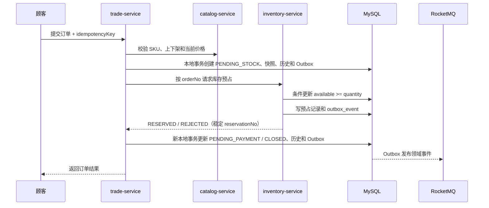

# 分布式一致性与高并发策略

## 1. 基本原则

1. 单服务内使用本地数据库事务。
2. 跨服务不使用跨库事务，采用状态机、Outbox、幂等消费和补偿任务。
3. MySQL 是订单、支付、库存和退款的最终事实。
4. Redis 负责缓存、准入和短期协调，不承担最终库存。
5. MQ 允许重复投递，所有消费者必须先设计幂等再消费。

## 2. 普通下单流程



库存更新必须由一条带条件的 SQL 完成，不能先查询再扣减。`order_no + sku_id` 或独立 `reservation_no` 建唯一索引。

如果库存预占成功但交易服务没有收到响应，交易服务按 `reservation_no` 查询结果，不能直接重复创建另一条预占。

当前实现不会把目录或库存 HTTP 调用包进交易数据库事务。远程服务不可用时订单保留在 `PENDING_STOCK`，恢复任务按相同预占号重试；取消时先进入 `CANCELING`，库存释放成功后才进入 `CANCELED`。

## 3. 支付与订单推进

- 支付服务先保存原始回调和渠道流水，唯一索引拦截重复回调。
- 本地事务内把支付单改为 `SUCCESS` 并写入 `outbox_event`。
- `trade-service` 消费 `PaymentSucceeded`，在同一本地事务内写 `consumed_event`、迁移订单到 `PAID` 并写 `OrderPaid` Outbox。
- `inventory-service` 只消费订单权威事实 `OrderPaid`，在同一本地事务内写 `consumed_event` 并确认预占库存。
- 这条事件链保证库存确认不会抢在订单状态裁决之前；任一步暂时失败都不确认 MQ 消息，等待重投。
- 后续 `fulfillment-service` 同样消费 `OrderPaid` 创建履约单，不直接消费渠道回调。

## 4. Outbox 与消费幂等

事件生产：

```text
业务表更新 + outbox_event 插入 = 同一个本地事务
后台发布器发送 MQ -> 成功后标记 published
定时任务重试超时未发布事件
```

事件信封至少包含：

```text
eventId, eventType, aggregateType, aggregateId, aggregateVersion,
occurredAt, producer, traceId, payloadVersion, payload
```

事件消费：

- `consumed_event(event_id, consumer_group)` 建联合唯一索引。
- 幂等记录与业务副作用必须在同一个本地事务中提交。
- 失败按退避策略重试；超过阈值进入死信/人工补偿列表。

## 5. 订单超时与库存释放

- 创建待支付订单时发送延迟消息。
- 延迟消息到达后再次读取订单当前状态，只有 `PENDING_PAYMENT` 才关闭。
- 关闭订单写 Outbox，库存服务消费后按预占号释放。
- 定时扫描作为兜底，不能只依赖一条延迟消息。
- 支付成功与超时关闭竞争时，以数据库条件更新决定唯一胜者，失败方重新读取最终状态。

## 6. 秒杀专用链路

秒杀属于第二阶段，不复用普通下单接口硬扛流量：

1. 网关限流、设备与账号风控。
2. Redis Lua 原子校验活动、用户资格和剩余准入量。
3. 成功请求写 RocketMQ，前端轮询结果。
4. 消费者按业务幂等键创建订单并请求 MySQL 最终预占。
5. Redis 与 MySQL 不一致时以 MySQL 为准，并通过对账任务修正 Redis。

Redis 不可用时秒杀入口直接降级为“活动繁忙”，不能穿透到 MySQL；普通下单仍可走数据库条件扣减。

## 7. 聊天与物流

### 聊天

- 消息先写 MySQL 和 Outbox，再确认发送成功。
- Redis 只保存在线状态、WebSocket 节点路由和未读计数。
- 跨节点投递使用 `ecommerce-chat-events`；MQ 故障时消息仍保留，稍后补发。
- `conversation_id + sender_id + client_message_id` 唯一，解决断线重发。

### 物流

- 承运商事件以 `carrier + tracking_no + external_event_id` 幂等。
- 物流节点追加到 MySQL，再通过事件推送通知和前端。
- Redis GEO 只保存最新坐标，关键节点和签收证明写 MySQL/MinIO。

## 8. 中间件降级矩阵

| 故障 | 降级行为 | 不允许发生 |
| --- | --- | --- |
| Redis 不可用 | 商品回源 MySQL；普通订单走 DB；秒杀暂停 | 把全部秒杀流量打到 DB |
| RocketMQ 不可用 | 业务事务与 Outbox 正常提交，发布器重试，界面显示处理中 | 丢弃事件或伪造下游成功 |
| Nacos 不可用 | 已运行实例使用本地配置和已有地址；阻止新发布 | 启动时静默使用错误配置 |
| MinIO 不可用 | 禁止新上传并明确提示；交易主流程继续 | 保存不存在的对象键 |
| 支付渠道不可用 | 订单保持待支付，可重试或关闭 | 本地直接标记支付成功 |
| 邮件不可用 | 站内信继续，邮件任务重试 | 让订单事务因邮件失败回滚 |

## 9. 正确性测试基线

- 库存 100、并发 1000 次下单，成功预占不超过 100，库存不为负。
- 同一 `idempotencyKey` 并发提交 100 次，只创建 1 个订单。
- 同一支付回调并发发送 100 次，只产生 1 次状态迁移和 1 个有效事件。
- 同一 MQ 事件重复投递 10 次，下游副作用只执行 1 次。
- 在“预占成功后响应丢失”位置注入故障，重试后不重复占库存。
- Redis 关闭时普通商品查询和普通下单仍可执行，秒杀明确拒绝。
- MQ 关闭后创建订单，再恢复 MQ，Outbox 可以补发并推进后续状态。

性能数字在接口完成后用同一台机器建立基线，先保证正确性，再比较吞吐和 P95/P99 延迟。
