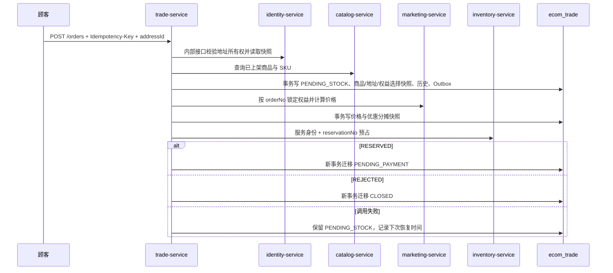

# 交易服务

`trade-service` 端口为 `18104`，数据独占 `ecom_trade` schema。当前切片实现购物车、普通订单、商品/地址/价格/优惠分摊快照、营销权益锁定、库存预占、取消、支付超时、恢复任务、支付与履约事件消费和 RocketMQ Outbox；售后留在后续独立切片。

## 1. 交易边界

| 表 | 职责 |
| --- | --- |
| `cart_item` | 用户购物车，按 `user_id + sku_id` 唯一 |
| `trade_order` | 订单事实、幂等键、库存预占号、恢复调度信息 |
| `order_item` | 商品名、SKU、规格、价格、图片键与数量快照 |
| `order_address_snapshot` | 下单时收件人、电话和配送地址的不可变快照 |
| `order_benefit_selection` | 营销调用成功前保存用户选择的权益编号，供恢复任务重试 |
| `order_price_snapshot` | 原价、各类优惠、总优惠、实付和营销锁号快照 |
| `order_discount_allocation` | 每份权益向每个订单项分摊的不可变金额快照 |
| `order_status_history` | 每一次状态迁移、命令、原因与操作者 |
| `outbox_event` | 与订单状态同事务提交的领域事件 |
| `consumed_event` | 后续 MQ 消费幂等基础表 |

交易服务不查询 identity、目录或库存数据库，不共享 Mapper/Entity。商品价格和用户自有地址只在下单时通过服务 API 获取，随后固化到订单表；商品改名、改价、地址编辑或删除都不能改写历史订单。

## 2. 接口

| Method | Path | 说明 |
| --- | --- | --- |
| `GET` | `/api/v1/trade/status` | 公共状态检查 |
| `PUT` | `/api/v1/trade/cart/items/{skuId}` | 新增或更新当前用户购物车项 |
| `GET` | `/api/v1/trade/cart/items` | 当前用户购物车 |
| `DELETE` | `/api/v1/trade/cart/items/{skuId}` | 删除当前用户购物车项 |
| `POST` | `/api/v1/trade/orders` | 创建订单，必须携带 `Idempotency-Key`，请求体包含 `addressId` |
| `GET` | `/api/v1/trade/orders` | 当前用户订单列表 |
| `GET` | `/api/v1/trade/orders/{orderNo}` | 当前用户订单详情 |
| `POST` | `/api/v1/trade/orders/{orderNo}/cancel` | 取消待支付订单 |
| `GET` | `/api/v1/trade/internal/orders/{orderNo}/payment-context` | 仅 payment-service 获取支付校验上下文 |

订单与购物车均从 JWT subject 取得用户 ID。知道别人的订单号并不能读取或取消别人的订单。

## 3. 下单与恢复



远程 HTTP 调用不占用交易数据库事务。预占响应丢失时，交易服务先按同一 `reservationNo` 查询库存结果；仍不可用则退避重试。相同用户与相同幂等键只能创建一笔订单，相同键携带不同商品、数量或地址快照会返回 `IDEMPOTENCY_CONFLICT`。

## 4. 取消与支付超时

取消不是直接把订单写成终态：

```text
PENDING_PAYMENT -> CANCELING -> CANCELED
```

进入 `CANCELING` 的事务先记录历史和 Outbox，再调用库存释放。释放调用失败时恢复任务按相同预占号重试；即使响应丢失，库存端的释放命令也具备幂等性。15 分钟支付截止后，定时任务复用同一条取消链路，原因记录为 `PAYMENT_TIMEOUT`。

## 5. 内部服务身份

浏览器不能通过网关访问任何包含 `/internal/` 的路径。交易服务通过 Nacos 直连 identity 与库存服务，附带 `X-Internal-Service: trade-service` 与本地生成的 256 位令牌；支付服务以同样机制读取订单支付上下文。管理员 JWT 不具备任一内部接口权限。

共享令牌是当前单机开发网络的务实基线，不等价于生产零信任。部署到多机环境时应使用 TLS/mTLS、网络策略、短期服务凭据、轮换和集中密钥管理。

## 6. 已验证基线

- 50 路相同幂等键并发提交，只创建一笔订单并只调用一次预占。
- 商品快照金额、规格、图片对象键与历史记录均落库。
- 地址所有权由 identity 校验，地址快照与订单同事务落库；源地址更新或删除后订单与履约目的地保持原值。
- 缺货订单进入 `CLOSED`，不会进入待支付。
- 库存故障保留 `PENDING_STOCK`，恢复后推进到 `PENDING_PAYMENT`。
- 用户取消与支付超时均经过 `CANCELING` 并释放库存。
- 交易 Outbox 发送失败保留，下一轮可以发布。
- 重复 `PaymentSucceeded` 只消费一次；订单迁移为 `PAID` 后发布一个 `OrderPaid`。
- 取消/关闭后晚到的支付成功进入 `PAYMENT_EXCEPTION` 并发布 `PaymentReviewRequired`，不会误确认库存。
- 履约事件严格推进 `PAID -> FULFILLING -> SHIPPED -> COMPLETED`，重复事件只生效一次，乱序事件事务回滚并等待重投。
- 真实 MySQL/Nacos/RocketMQ 链路中，30 个订单竞争 5 件库存，结果严格为 5 个 `PENDING_PAYMENT`、25 个 `CLOSED`；取消一单后库存从 0 个可用恢复为 1 个。
