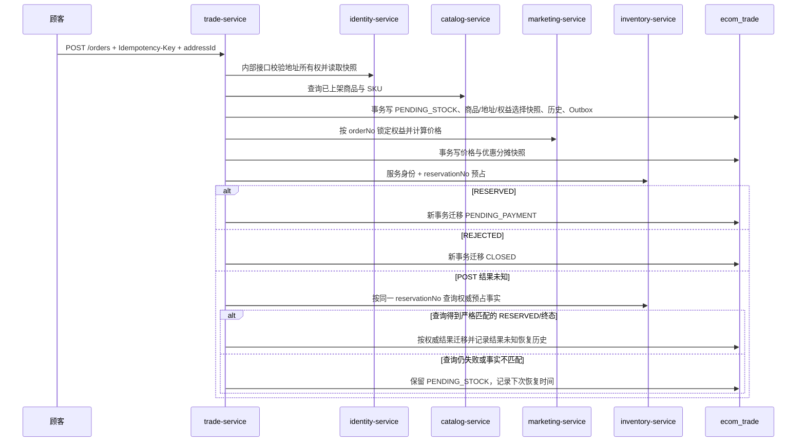

# 交易服务

`trade-service` 端口为 `18104`，数据独占 `ecom_trade` schema。当前切片实现购物车、普通订单、秒杀排队订单、商品/地址/价格/优惠分摊快照、营销权益锁定、库存预占、取消、支付超时、恢复任务、支付与履约事件消费、首版整单售后聚合，以及订单完成时面向评价资格投影的不可变订单行事件。

## 1. 交易边界

| 表 | 职责 |
| --- | --- |
| `cart_item` | 用户购物车与加入时商品展示快照，按 `user_id + sku_id` 唯一 |
| `cart_user_lock` | 按用户串行化购物车写入与游客合并，不承担业务事实 |
| `cart_merge_request` | 游客购物袋合并键、请求哈希与成功提交事实 |
| `trade_order` | 订单事实、幂等键、库存预占号、恢复调度信息 |
| `order_item` | 商品名、SKU、规格、价格、图片键与数量快照 |
| `order_address_snapshot` | 下单时收件人、电话和配送地址的不可变快照 |
| `order_benefit_selection` | 营销调用成功前保存用户选择的权益编号，供恢复任务重试 |
| `order_price_snapshot` | 原价、各类优惠、总优惠、实付和营销锁号快照 |
| `order_discount_allocation` | 每份权益向每个订单项分摊的不可变金额快照 |
| `order_status_history` | 每一次状态迁移、命令、原因与操作者 |
| `after_sale_order` | 整单售后事实、幂等键、退款金额、退货单号和退款单号 |
| `after_sale_item` | 从订单行价格分摊复制的不可变退款明细 |
| `after_sale_history` | 售后审核、寄回、验收、退款结果的追加式状态历史 |
| `outbox_event` | 与订单状态同事务提交的领域事件；`OrderCompleted` 携带不可变订单行快照 |
| `consumed_event` | 后续 MQ 消费幂等基础表 |
| `consumer_failure` | 售后消息失败、投递次数及人工补偿状态 |
| `reconciliation_record` | 订单/售后所有者域问题的 `OPEN/RESOLVED` 历史台账 |
| `flash_sale_order_request` | 秒杀准入事件、幂等请求哈希、建单恢复状态和最终结果 |
| `distributed_id_worker_lease` | 分布式 ID namespace + worker 的 MySQL 租约、owner 与有效期 |

交易服务不查询 identity、目录或库存数据库，不共享 Mapper/Entity。商品价格和用户自有地址只在下单时通过服务 API 获取，随后固化到订单表；商品改名、改价、地址编辑或删除都不能改写历史订单。

## 2. 接口

| Method | Path | 说明 |
| --- | --- | --- |
| `GET` | `/api/v1/trade/status` | 公共状态检查 |
| `PUT` | `/api/v1/trade/cart/items/{skuId}` | 新增或更新当前用户购物车项 |
| `GET` | `/api/v1/trade/cart/items` | 当前用户购物车 |
| `DELETE` | `/api/v1/trade/cart/items/{skuId}` | 删除当前用户购物车项 |
| `POST` | `/api/v1/trade/cart/guest-merge` | 按 `Idempotency-Key` 累加游客购物袋，不覆盖已有数量 |
| `POST` | `/api/v1/trade/orders` | 创建订单，必须携带 `Idempotency-Key`，请求体包含 `addressId` |
| `GET` | `/api/v1/trade/orders` | 当前用户订单列表 |
| `GET` | `/api/v1/trade/orders/page` | 当前用户 offset 分页订单，返回总数 |
| `GET` | `/api/v1/trade/orders/cursor` | 当前用户按 `createdAt + id` 游标读取订单 |
| `GET` | `/api/v1/trade/orders/by-idempotency-key/{key}` | 当前用户按原幂等键查询订单结果 |
| `GET` | `/api/v1/trade/orders/{orderNo}` | 当前用户订单详情 |
| `POST` | `/api/v1/trade/orders/{orderNo}/cancel` | 取消待支付订单 |
| `GET` | `/api/v1/trade/internal/orders/{orderNo}/payment-context` | 仅 payment-service 获取支付校验上下文 |
| `POST` | `/api/v1/trade/orders/{orderNo}/after-sales` | 顾客按幂等键申请整单售后 |
| `GET` | `/api/v1/trade/after-sales`、`/{afterSaleNo}` | 顾客查看自己的售后 |
| `POST` | `/api/v1/trade/after-sales/{afterSaleNo}/cancel` | 顾客撤销待审核申请 |
| `GET/POST` | `/api/v1/trade/admin/after-sales/**` | 管理员查询和审核售后 |
| `GET` | `/api/v1/trade/admin/reconciliation/issues` | ADMIN 按状态只读查询订单/售后对账问题 |

### 2.1 管理端售后审核恢复边界

售后审核 POST 没有独立命令 ID，但服务端在行锁本地事务中保存审核原因、状态历史、
操作者和 Outbox。目标状态已经等于本次决定时，接口只返回已有售后事实，不追加第二次
状态迁移。管理 DTO 公开 `reviewReason`、`status`、`approvedAt` 和 `version`，但不
公开审核命令身份。

V6.4.3 管理前端据此采用 authority-first 协议：

1. POST 前按管理员冻结售后号、通过/拒绝决定和完整审核原因；
2. 网络、超时、非法响应或 5xx 后保持结果未知，不直接显示成功；
3. 必须先调用管理详情 GET；
4. 相同决定、相同原因和合法状态路径只确认业务结果，并明确不虚构命令 ID；
5. 只有权威状态仍为 `APPLIED` 才允许原决定与原因只读重试；
6. 状态或原因不匹配时终止 pending，不能冒领另一位管理员的审核。

管理页面完整展示 `APPLIED / WAIT_RETURN / RETURNING / RECEIVED / REFUNDING /
REFUND_FAILED / COMPLETED / REJECTED / CANCELED` 九种状态，并保留订单行退款金额和
优惠分摊快照。完整代码、自动化和 Chromium 请求证据见
[V6.4.3 After-sale 管理审核工作区](98-frontend-visual-v6-4-3-after-sale-20260803.md)。

订单与购物车均从 JWT subject 取得用户 ID。知道别人的订单号并不能读取或取消别人的订单。

游客购物袋合并规则：

1. 前端为一份待提交快照生成稳定 `Idempotency-Key`，同一次结果未知重试不得换键或换载荷。
2. 服务端按 SKU 排序后计算 SHA-256 请求哈希；同用户、同键、不同载荷返回 `IDEMPOTENCY_CONFLICT`。
3. 同 SKU 使用“账户已有数量 + 游客数量”，上限为购物车数量约束，不执行覆盖。
4. `cart_user_lock` 使普通 PUT、删除和合并在同一用户维度串行，避免不同购物车写命令相互覆盖。
5. `cart_merge_request` 与购物车变更在同一 MySQL 本地事务提交；只有该事务成功，合并键才成为已完成事实。
6. 响应丢失后使用原键重试不会再次累加；前端收到成功前保留本地商品和原重试键。

购物车响应中的 `id/productId/skuId`，以及订单地址快照、订单项、优惠分摊和售后视图中的浏览器业务 ID，已局部序列化为 JSON string；请求仍接受字符串形式的十进制 ID。没有修改全局 ObjectMapper。最终 M4 审查曾发现 `OrderPaid` 复用浏览器地址 DTO，导致局部 `ToStringSerializer` 污染 Outbox；现已改为独立事件 Map，并以 Outbox JSON 回归测试固定数值语义。

购物车在 PUT 与游客合并时保存商品标题、SKU 名称、规格和单价展示快照。Catalog 后续改价不会静默重写用户已经看到的购物车；历史旧行在快照列为空时才回退查询 Catalog。展示快照不是成交承诺，M4 第四批的 `/checkout` 仍会重新读取 Catalog 当前价格和 Inventory 权威库存。

M4 第四批已经接通 `POST /orders`。前端对同一待提交命令固定请求快照与 `order:{uuid}` 幂等键；网络、超时、非法响应或 5xx 后，先调用按幂等键查询接口恢复结果。404 只表示当前尚未查询到稳定订单事实，原请求与原键继续保留，不能换键盲目重提。

M4 第五批已经接通当前用户订单列表与顾客取消。列表按 JWT subject 过滤并按创建时间倒序返回；订单详情、按幂等键查询和取消统一校验所有者，跨账户返回 `404 RESOURCE_NOT_FOUND`，避免泄露订单号是否存在。

M7 第一批保留旧数组和 offset 分页契约，同时新增 keyset 游标。Small 数据包含 50,000 笔订单，其中固定用户 40,000 笔；深 offset 跳过 31,900 行时 SQL P50 为 3.214 ms，keyset 为 0.223 ms，API 返回的 100 条订单顺序和内容一致。订单子表仍按页批量加载，不恢复 N+1。完整证据见 [M7 第一批：规模数据、查询基线与游标分页](49-m7-scale-data-and-cursor-pagination.md)。

M7 第二批将普通订单与秒杀订单的 `trade_order.id` 接入 41 位时间戳、10 位 worker、12 位序列的公共生成器，`orderNo` 和 `reservationNo` 继续由该主键稳定派生。显式 worker 配置优先；否则由 `SERVICE_INSTANCE_ID` 确定性派生，并由 Trade 自有 MySQL 租约阻断碰撞。续租失败、租约进入最后一个续租安全窗或时钟回拨时立即拒绝继续发号。三个真实 JVM 共生成 3,000 个 ID，碰撞为 0，重复 worker JVM 启动失败；验证端点只在 `m7-id-verification` Profile 下存在。订单子表和历史表暂不机械替换内部行 ID。完整证据见 [M7 第二批：分布式 ID 与节点租约](50-m7-distributed-id.md)。

M7 第四批使用 ShardingSphere-JDBC 5.5.3 将 Trade 表路由到两个真实 MySQL
schema，规则为 `user_id % 2`。顾客侧查询和命令直接单片；后台仅持有订单号或
售后号时，先进行受控只读广播定位用户，再在 Hint 早于事务取连接的前提下
进入单片。支付、履约、库存回补和退款事件携带 `userId`，`consumed_event`
与业务副作用同片。Outbox 逐片领取并轮转首片，发布结果回原片；对账逐片开启
本地事务。完整证据见 [M7 第四批：Trade 两分片代表实现](52-m7-trade-sharding.md)。

M7 第五批在两个真实 MySQL 分片上完成历史订单归档迁移。资格要求订单早于固定
截止点并已终态，同时不存在非终态售后、待发布 Outbox 或开放对账问题。每片
独立使用稳定订单 ID 游标、checkpoint 和批次审计；提交后中断从原游标续跑，
显式刷新水位后两片均从 3 笔候选扩为 4 笔并完成。11 张订单聚合与 Outbox 表
使用逐表行数和全列指纹核对，人为修改归档金额会阻止切读。回滚只删除归档副本，
源订单仍各 9 笔，随后可以重新迁移和切读。完整证据见
[M7 第五批：Trade 历史归档迁移、校验与回滚](53-m7-trade-history-archive-migration.md)。

M7 第六批完成受控主动 `user_id % 2 -> user_id % 4` 重分片。V15 为
`consumed_event` 增加 `owner_user_id`，新消费事实与业务副作用保持同片；历史 NULL
所有者不允许猜测，存在时初始化直接失败。迁移按源分片本地批事务和 checkpoint
续跑，初始复制期间允许源继续变化，最终短维护写栅栏后重新追平新增、更新、删除和
目标孤儿行。四片 17 张用户表及固定到 `ds_0` 的 `consumer_failure` 共 69 组全列
指纹一致；篡改阻止切换，四片 JVM 路由、跨用户 404、受限回滚和回滚后重放通过。
该机制没有反向复制，目标产生新写后不能直接回滚。完整证据见
[M7 第六批：Trade 主动 2→4 重分片](54-m7-trade-active-resharding.md)。

M8.10 在 `ShipmentSigned` 把订单从 `SHIPPED` 迁移为 `COMPLETED` 的同一事务中写入
`OrderCompleted` Outbox。事件 `payloadVersion=1`，包含订单所有者和每个订单行的
`lineNo/productId/skuId/productTitle/skuCode/skuName/specJson/imageObjectKey/quantity`。
这些字段直接来自成交时保存的 `order_item`，Catalog 无需回查当前商品，也不会因
商品改名、改规格或下架而失去历史评价资格。

Trade 不提供“发布评价前同步校验”接口。Outbox 发布失败时保持 `PENDING` 并重试；
Catalog 收到事件后在自己的 schema 内生成资格、处理评价和审核。完整证据见
[M8 第十批：商品评价、并发幂等与审核治理](65-m8-product-reviews.md)。

## 3. 下单与恢复



远程 HTTP 调用不占用交易数据库事务。Trade→Marketing 锁价命令以稳定 `orderNo`、Marketing 唯一约束和 `requestHash` 校验为安全重试前提，已配置独立的连接/读取/总预算、最多两次总尝试、熔断和并发舱壁；失败时保持 `PENDING_STOCK`，取得权威锁价事实前不调用库存。

库存预占使用稳定 `reservationNo`。POST 抛出连接或响应异常时，Trade 不把超时解释成失败，也不直接伪造成功，而是立即查询同一预占号。查询结果必须与原命令的预占号、订单号、仓库、过期时间和 SKU/数量集合全部一致，否则按幂等冲突拒绝推进；查询仍失败时保留 `PENDING_STOCK` 并退避。成功恢复会记录 `RESOLVE_STOCK_RESULT / RESERVE_RESPONSE_UNKNOWN` 历史，并通过 `ecommerce.trade.inventory.reservation.unknown.result.resolutions{outcome="recovered|unresolved"}` 观测。详见 [M3 Inventory 预占结果未知恢复](30-m3-inventory-unknown-result-recovery.md)。

相同用户与相同幂等键只能创建一笔订单。Trade 在调用 Address、Catalog、Marketing 或 Inventory 前先查询已有稳定幂等事实；已存在且请求哈希一致时直接返回原订单，不再次调用远程依赖。请求哈希只使用地址 ID、规范化并排序的商品行和权益编号等客户端命令事实，不使用每次重试可能变化的远程快照。相同键携带不同地址、商品、数量或权益会返回 `IDEMPOTENCY_CONFLICT`。按幂等键查询同样校验 JWT 所有者，跨用户返回 404。同步韧性基线详见 [关键同步调用韧性](22-synchronous-call-resilience.md)。

## 4. 取消与支付超时

取消不是直接把订单写成终态：

```text
PENDING_PAYMENT -> CANCELING -> CANCELED
```

进入 `CANCELING` 的事务先记录历史和 Outbox，再调用库存释放。释放调用失败时恢复任务按相同预占号重试；即使响应丢失，库存端的释放命令也具备幂等性。取消 HTTP 在释放与权威查询均不可用时返回真实 `CANCELING`，重复调用不会重复写入 `CANCELING` 迁移。前端在取消响应超时、断连、非法响应或 5xx 后查询同一订单，只在 Trade 返回 `CANCELED` 后显示终态；仍为 `PENDING_PAYMENT` 时保留同账户待确认记录，跨账户不查询、不重试。15 分钟支付截止后，定时任务复用同一条取消链路，原因记录为 `PAYMENT_TIMEOUT`。

## 5. 内部服务身份

浏览器不能通过网关访问任何包含 `/internal/` 的路径。交易服务通过 Nacos 直连 identity 与库存服务，附带 `X-Internal-Service: trade-service` 与本地生成的 256 位令牌；支付服务以同样机制读取订单支付上下文。管理员 JWT 不具备任一内部接口权限。

共享令牌是当前单机开发网络的务实基线，不等价于生产零信任。部署到多机环境时应使用 TLS/mTLS、网络策略、短期服务凭据、轮换和集中密钥管理。

## 6. 已验证基线

- 50 路相同幂等键并发提交，只创建一笔订单并只调用一次预占。
- 20 路相同游客合并键并发重试只累加一次；顺序重试保持数量不变，异载荷返回 `IDEMPOTENCY_CONFLICT`。
- 真实 Gateway + Identity + Catalog + Trade + MySQL/Nacos 链路验证已有数量 3 与游客数量 2 合并为 5，同键重试仍为 5，异载荷冲突后数量不变。
- M4 第四批真实链路验证购物车保留 ¥189.00 展示快照，而 Catalog 当前单价为 ¥199.00；结算复核读取 Inventory 可用 5 件和 Marketing ¥398.00 - ¥20.00 = ¥378.00 无副作用试算。
- 使用稳定 `order:{token}` 创建一笔 `PENDING_PAYMENT` 订单后，按幂等键查询、同键重试和订单号查询均返回同一事实；Trade、Inventory、Marketing 分别严格保持一笔订单、一笔预占和一笔价格锁。取消后库存恢复 5/0，Marketing 通过 `OrderCanceled` 异步事件把权益恢复为 `AVAILABLE`。
- M4 第五批真实故障验证中，当前账户订单列表返回该订单，另一账户列表为空，跨账户读取与取消均返回 404。Inventory 停机后，取消故障代理记录 Trade 上游已经返回 HTTP 200 并主动断开响应；前端随后查询恢复为 `CANCELING`，Inventory 恢复后 Trade 调度最终推进为 `CANCELED`，库存恢复 available 5 / reserved 0，营销权益恢复 `AVAILABLE`。
- M4 后续顾客端已接通 Payment、Fulfillment、确认收货和整单售后；支付创建与确认收货响应丢失均通过所有者域查询恢复，Trade 分别最终收敛到 `PAID` 与 `COMPLETED`。详见 [M4 Payment 与结果未知恢复](38-m4-payment-and-unknown-result-recovery.md)和 [M4 履约与物流时间线](39-m4-fulfillment-and-logistics-timeline.md)。
- 商品快照金额、规格、图片对象键与历史记录均落库。
- 地址所有权由 identity 校验，地址快照与订单同事务落库；源地址更新或删除后订单与履约目的地保持原值。
- 缺货订单进入 `CLOSED`，不会进入待支付。
- 库存故障保留 `PENDING_STOCK`，恢复后推进到 `PENDING_PAYMENT`。
- 真实故障代理已证明 Inventory 完成 MySQL 预占并返回 HTTP 200 后，Trade 连接在读取响应前被断开；Trade 使用同一 `reservationNo` 查询恢复到 `PENDING_PAYMENT`，库存只有一条预占事实和一条预占流水，恢复历史和 `OrderAwaitingPayment` Outbox 各一条。
- Marketing 停机突发下，首笔同步失败和独立调度恢复失败连同三笔故障订单打开熔断，第 5 笔在本地快速拒绝；5 笔订单均不提前预占库存，恢复后生成 5 个唯一价格锁并收敛，取消后库存完全释放。
- 用户取消与支付超时均经过 `CANCELING` 并释放库存。
- 交易 Outbox 发送失败保留，下一轮可以发布。
- Trade Outbox 已增加 `claim_owner + claim_until`、过期 owner 围栏、聚合前驱约束和事务内 `FOR UPDATE SKIP LOCKED` 批量领取；只有 RocketMQ 异步 ACK 成功后才标记 `PUBLISHED`。真实 MySQL/RocketMQ 的 1/2/3 实例各 1000 条实验均完全收敛，同聚合顺序违规、状态冲突和正式轮死锁均为 0；2 实例吞吐最佳，3 实例用于正确性和故障实验而非默认性能配置。详见 [M3 Trade Outbox 多实例抢占与租约](27-m3-trade-outbox-multi-instance.md)。
- 重复 `PaymentSucceeded` 只消费一次；订单先进入 `PAYMENT_CONFIRMING`，只有 Inventory
  权威返回 `CONFIRMED` 才迁移为 `PAID` 并发布一个 `OrderPaid`。确认结果未知时保留
  恢复任务，终态库存不可用则进入 `PAYMENT_EXCEPTION`。
- 取消/关闭后晚到的支付成功进入 `PAYMENT_EXCEPTION` 并发布 `PaymentReviewRequired`，不会误确认库存。
- 履约事件严格推进 `PAID -> FULFILLING -> SHIPPED -> COMPLETED`，重复事件只生效一次，乱序事件事务回滚并等待重投。
- `ShipmentSigned` 推进 `COMPLETED` 时只生成一个 `OrderCompleted` Outbox，事件携带
  不可变订单行快照；Trade 所有者域对账把完成订单缺少该事件识别为
  `ORDER_STATE_EVENT_MISSING`。
- M8.10 真实验证中，RocketMQ Proxy 停机时 `OrderCompleted` 保持 `PENDING` 且
  Catalog 不提前生成资格；Proxy 恢复后事件变为 `PUBLISHED`，评价资格收敛，Trade
  未发布 Outbox 为 0。
- 只有在配置的 30 天窗口内完成的订单可申请；同一订单最多一笔整单售后。
- 售后金额和每行可退金额直接复制订单实付与优惠分摊快照，营销规则变化不影响历史退款。
- 历史订单在 V6 迁移中先补齐稳定 `line_no`，再收紧价格快照列的非空约束。
- `RefundFailed -> RefundSucceeded` 可收敛为完成；成功后晚到的失败事件被确认为过时消息，不回退售后状态。
- 核心支付/履约与售后消费者校验事件版本和载荷；不可解析消息直接进入 `consumer_failure.NEEDS_ATTENTION`，业务异常有限重试，恢复后标记 `RECOVERED`，不会无限阻塞消费组。
- `ADMIN` 可通过只读 `businessprocesses` 运维端点定位 `PENDING_STOCK`、`CANCELING`、`PAYMENT_EXCEPTION` 和售后非终态的数量、最老年龄与业务编号；响应不包含用户身份，指标使用有界 `domain/status` 标签。
- 真实 MySQL/Nacos/RocketMQ 链路中，30 个订单竞争 5 件库存，结果严格为 5 个 `PENDING_PAYMENT`、25 个 `CLOSED`；取消一单后库存从 0 个可用恢复为 1 个。
- 订单恢复已从多个 MQ 长轮询使用的默认单线程中隔离到独立、上限为 1 的调度器；真实测试从约 25 秒延迟降低为 6.33 秒再次调用，并验证完成年龄、执行结果和 executor 饱和指标。详见 [Trade 订单恢复调度隔离](23-trade-scheduling-isolation.md)。
- 所有者域对账覆盖订单历史、价格快照、商品行金额、状态事件，以及售后历史、完成字段、商品行金额和状态事件；问题只记录并告警，事实恢复后转为 `RESOLVED`。详见 [Trade 与 Fulfillment 所有者域对账](25-trade-fulfillment-reconciliation.md)。
- 1000 请求、100 并发真实准入中严格得到 100 笔初始可支付、900 笔缺货关闭，P95 为 2492.45 ms；同一订单键 100 次并发只产生一套跨域事实。消息链收敛为 1018.326 秒，99 个未付款预占按 15 分钟规则过期，作为 M3 的明确瓶颈基线。
- M6 秒杀使用独立 Topic、消费组、`flash-sale` 调度池和 `flash_sale_order_request` 状态机。重复准入事件按 `request_token`、`admission_event_id` 和请求哈希幂等；可恢复异常保持 `PROCESSING` 并有限重试，耗尽后进入 `NEEDS_ATTENTION`，不伪造订单成功。
- M6 真实 MQ 停机恢复后，101 条接受事实全部创建唯一 `FLASH_SALE` 订单并回写 Marketing；Trade 最终 `PROCESSING=0`、`ORDER_CREATED=101`、`FAILED=0`、`NEEDS_ATTENTION=0`。完整证据见 [M6 秒杀排队、最终裁决与毕业报告](47-m6-flash-sale-queue-and-graduation.md)。
- M7 两分片真实闭环中，奇偶用户订单及全部快照分别只存在于 `ds_0/ds_1`；
  offset、keyset 与点查通过，`PaymentSucceeded` 幂等事实与订单同片，履约、
  签收、整单售后、库存回补和退款完成；两片 Outbox 待发布、OPEN 对账和
  `consumer_failure` 均为 0，库存恢复 `10|0|10`。最终 27 份报告、109 tests
  全通过，PMD 0，SpotBugs Priority 1 为 0。
- M7 历史归档工具按分片执行本地批事务，保留任务、批次、manifest 和切读门禁；
  中断时 `ds_0=2/3、ds_1=0/3`，恢复并刷新水位后两片均为 `4/4`，完成后重跑
  新增批次为 0。11 表指纹能定位人为金额篡改；回滚后归档订单为 0、源订单无
  删除，并可再次完成迁移。
- M7 主动重分片真实验证中，源两片在线变化在最终写栅栏后全部追平，69 组全列
  指纹一致，目标篡改被阻止；用户 1000/1001/1002/1003 分别只从目标
  `ds_0/ds_1/ds_2/ds_3` 读取，跨所有者返回 404。回滚只清空目标，源订单保持
  `5/5`，随后再次迁移为 `PROMOTED`；临时 schema、Java、端口和清理错误均为 0。
