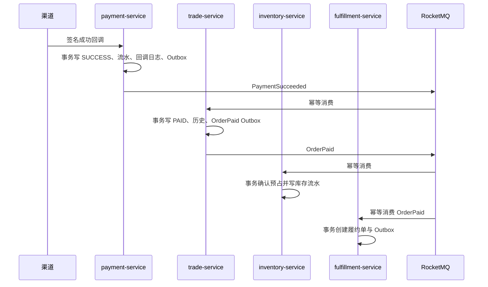

# 支付服务

`payment-service` 端口为 `18105`，数据独占 `ecom_payment` schema。当前切片实现支付单、模拟渠道、HMAC 回调校验、渠道流水、回调审计、支付 Outbox 与重复回调幂等；真实支付 SDK、退款和对账留给后续切片。

## 1. 数据边界

| 表 | 职责 |
| --- | --- |
| `payment_order` | 平台支付单、订单号、用户、金额、渠道和状态 |
| `payment_transaction` | 不可变渠道交易流水，渠道交易号唯一 |
| `payment_callback_log` | 原始回调、签名结果、处理结果，渠道事件号唯一 |
| `outbox_event` | 与支付成功同事务提交的 `PaymentSucceeded` |
| `consumed_event` | 后续退款/对账事件消费的幂等基础表 |

支付服务不读写交易或库存 schema。创建支付时使用服务身份通过 Nacos 直连交易内部接口，校验订单所有者、`PENDING_PAYMENT`、金额、预占号与支付截止时间。

## 2. 接口

| Method | Path | 鉴权 | 说明 |
| --- | --- | --- | --- |
| `GET` | `/api/v1/payment/status` | 公共 | 服务状态 |
| `POST` | `/api/v1/payment/payments` | CUSTOMER / ADMIN | 创建支付，必须携带 `Idempotency-Key` |
| `GET` | `/api/v1/payment/payments/{paymentNo}` | CUSTOMER / ADMIN | 仅支付单所有者可读 |
| `POST` | `/api/v1/payment/callbacks/mock` | HMAC 签名 | 模拟渠道异步回调 |

## 3. 回调安全与幂等

模拟渠道签名原文为：

```text
paymentNo|externalEventId|externalTransactionNo|status|normalizedAmount|epochSecond
```

使用本地 `.env` 中的 `MOCK_PAYMENT_CALLBACK_SECRET` 计算 HMAC-SHA256 十六进制签名。服务采用常量时间比较，拒绝超过五分钟的时间戳。生产接真实渠道时必须替换为渠道官方验签、证书轮换和来源校验，不能复用模拟密钥。

`channel + external_event_id`、`channel + channel_transaction_no` 和 `order_no` 均有唯一约束。相同回调并发到达时只产生一条渠道流水和一个 `PaymentSucceeded`，相同事件号携带不同内容返回幂等冲突。非法签名和业务校验失败保留拒绝审计，不改变支付状态。

## 4. 跨服务事件链



交易服务先裁决订单是否仍可支付，再发布订单权威事实；库存不直接消费渠道事实，从而避免取消与支付并发时先扣库存、后发现订单已关闭。消费端采用可重连 `SimpleConsumer`，MQ 故障时服务保持在线，恢复后继续消费未确认消息。

如果取消或关闭先完成，交易服务消费支付成功后进入 `PAYMENT_EXCEPTION`，发布 `PaymentReviewRequired` 而不是 `OrderPaid`。当前切片保留可审计异常并避免误扣库存；自动原路退款在退款切片实现前由人工复核处理。

## 5. 已验证基线

- 30 路相同创建请求只生成一笔支付单。
- 30 路相同成功回调只生成一条回调日志、一条渠道流水和一个支付成功事件。
- 错误签名、过期时间戳和金额不一致不会修改支付状态。
- 支付 Outbox 失败后保留并可重试。
- 真实 MySQL/Nacos/RocketMQ 链路中，重复签名回调最终严格收敛为支付 `SUCCESS`、预占 `CONFIRMED`、履约单 `CREATED`，订单随后由履约事件继续推进，库存恒等式保持成立。
