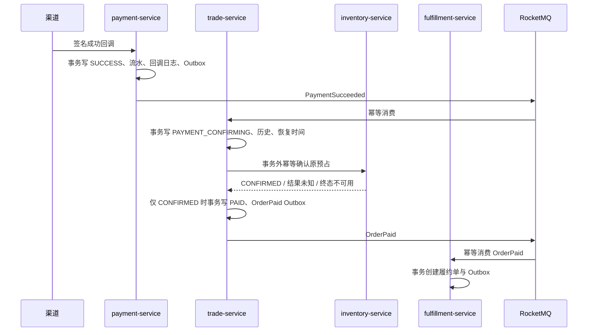

# 支付服务

`payment-service` 端口为 `18105`，数据独占 `ecom_payment` schema。当前切片实现支付单与整单退款单、模拟渠道、HMAC 回调校验、渠道流水、回调审计、持久化退款请求投递、有限重试和 Outbox；真实支付 SDK 与财务对账仍在后续切片。

## 1. 数据边界

| 表 | 职责 |
| --- | --- |
| `payment_order` | 平台支付单、订单号、用户、金额、渠道和状态 |
| `payment_transaction` | 不可变渠道交易流水，渠道交易号唯一 |
| `payment_callback_log` | 原始回调、签名结果、处理结果，渠道事件号唯一 |
| `refund_order` | 按售后单唯一的退款事实、金额、渠道结果和请求投递状态 |
| `refund_transaction` | 渠道退款号唯一；同一渠道尝试可从失败推进到成功 |
| `refund_callback_log` | 每个退款回调事件的原文、签名和处理结果 |
| `outbox_event` | 与支付成功同事务提交的 `PaymentSucceeded` |
| `consumed_event` | 退款请求事件消费的幂等基础表 |
| `consumer_failure` | 无法恢复的消息报文与人工补偿状态 |
| `refund_dispatch_retry_audit` | 管理员退款派发补偿命令的追加式接受/拒绝审计 |
| `reconciliation_record` | 支付/退款所有者域对账问题的 `OPEN/RESOLVED` 历史台账 |

支付服务不读写交易或库存 schema。创建支付时使用服务身份通过 Nacos 直连交易内部接口，校验订单所有者、`PENDING_PAYMENT`、金额、预占号与支付截止时间。该查询边界已建立连接/读取/总预算约束、幂等有限重试、熔断和并发舱壁；Trade 事实不可用时返回明确的依赖不可用结果，且不会先写支付单。详见 [关键同步调用韧性](22-synchronous-call-resilience.md)。

## 2. 接口

| Method | Path | 鉴权 | 说明 |
| --- | --- | --- | --- |
| `GET` | `/api/v1/payment/status` | 公共 | 服务状态 |
| `POST` | `/api/v1/payment/payments` | CUSTOMER / ADMIN | 创建支付，必须携带 `Idempotency-Key` |
| `GET` | `/api/v1/payment/payments/{paymentNo}` | CUSTOMER / ADMIN | 仅支付单所有者可读 |
| `POST` | `/api/v1/payment/callbacks/mock` | HMAC 签名 | 模拟渠道异步回调 |
| `GET` | `/api/v1/payment/refunds/{refundNo}` | CUSTOMER / ADMIN | 退款所有者查询 |
| `GET` | `/api/v1/payment/refunds/by-after-sale/{afterSaleNo}` | CUSTOMER / ADMIN | 按售后号查询自己的退款 |
| `POST` | `/api/v1/payment/callbacks/mock/refunds` | HMAC 签名 | 模拟退款渠道独立回调 |
| `POST` | `/api/v1/payment/admin/refunds/{refundNo}/retry-dispatch` | ADMIN + `Idempotency-Key` | 仅对可恢复状态执行领域授权重试，正文必须提供原因 |
| `GET` | `/api/v1/payment/admin/refunds/{refundNo}/retry-dispatch/audits` | ADMIN | 查询该退款的补偿命令审计 |
| `GET` | `/api/v1/payment/admin/reconciliation/issues` | ADMIN | 按 `OPEN/RESOLVED` 查询支付与退款对账问题 |

## 3. 回调安全与幂等

模拟渠道签名原文为：

```text
paymentNo|externalEventId|externalTransactionNo|status|normalizedAmount|epochSecond
```

使用本地 `.env` 中的 `MOCK_PAYMENT_CALLBACK_SECRET` 计算 HMAC-SHA256 十六进制签名。服务采用常量时间比较，拒绝超过五分钟的时间戳。生产接真实渠道时必须替换为渠道官方验签、证书轮换和来源校验，不能复用模拟密钥。

`channel + external_event_id`、`channel + channel_transaction_no` 和 `order_no` 均有唯一约束。相同回调并发到达时只产生一条渠道流水和一个 `PaymentSucceeded`，相同事件号携带不同内容返回幂等冲突。非法签名和业务校验失败保留拒绝审计，不改变支付状态。

退款回调签名原文为：

```text
refundNo|externalEventId|externalRefundNo|status|normalizedAmount|epochSecond
```

Payment 消费 `RefundRequested` 时再次校验成功支付单的订单、用户和全额金额，并以 `afterSaleNo` 唯一创建退款单。渠道请求由数据库状态驱动：原子抢占 `PENDING -> REQUESTING`，传输失败回到 `PENDING`，进程中断的长期 `REQUESTING` 会被恢复；达到最大次数转为 `NEEDS_ATTENTION`。Mock 适配器只确认请求已接收并等待独立回调，绝不直接制造成功。

管理员重试不是任意状态重置。只有 `PROCESSING/NEEDS_ATTENTION` 或渠道已明确失败的 `FAILED/SENT` 可以重新进入 `PROCESSING/PENDING`；已经排队、正在调用、结果未知或成功的退款拒绝新命令。命令键、管理员 subject、原因和状态前后值写入本地追加式审计，同一命令不会重复派发。详见 [领域授权补偿与审计](19-compensation-governance.md)。

渠道可能使用同一个 `externalRefundNo` 先通知失败、后通知成功。系统更新同一渠道退款记录并分别保留两条回调日志和两个领域事件，避免唯一键冲突回滚成功事实。

## 4. 跨服务事件链



交易服务先保留支付事实，再在本地事务之外调用库存所有者域；只有 MySQL 权威预占状态
为 `CONFIRMED` 才发布订单权威事实。确认响应和查询都失败时保持
`PAYMENT_CONFIRMING`，不提前生成履约或核销权益；终态库存不可用进入
`PAYMENT_EXCEPTION`。消费端采用可重连 `SimpleConsumer`，MQ 故障时服务保持在线，
恢复任务继续查询同一预占号。

如果取消或关闭先完成，交易服务消费支付成功后进入 `PAYMENT_EXCEPTION`，发布 `PaymentReviewRequired` 而不是 `OrderPaid`。该异常分支保留可审计事实并避免误扣库存；当前仍由人工复核决定是否发起原路退款，不自动把异常支付并入普通售后退款链。

## 5. 已验证基线

- 30 路相同创建请求只生成一笔支付单。
- 30 路相同成功回调只生成一条回调日志、一条渠道流水和一个支付成功事件。
- 错误签名、过期时间戳和金额不一致不会修改支付状态。
- 支付 Outbox 失败后保留并可重试。
- 真实 MySQL/Nacos/RocketMQ 链路中，重复签名回调最终严格收敛为支付 `SUCCESS`、预占 `CONFIRMED`、履约单 `CREATED`，订单随后由履约事件继续推进，库存恒等式保持成立。
- 退款请求传输超时保持 `PROCESSING`，恢复投递后仍等待独立回调，不伪造渠道成功。
- 同一渠道退款号的失败后成功可以收敛，重复回调无重复资金事件。
- 超过消息投递阈值的无效版本或毒丸消息进入 `consumer_failure`，不会永久阻塞消费组。
- `ADMIN` 可通过只读 `businessprocesses` 运维端点定位 `PROCESSING`、`FAILED` 和退款投递 `NEEDS_ATTENTION` 的数量、最老年龄、退款号、投递阶段与最后错误；响应不包含客户身份。
- 退款派发人工重试具备管理员权限、稳定命令键、请求冲突检测、同退款并发串行化、接受/拒绝审计和只读审计查询。
- 本地定时对账检查成功状态、渠道流水、Outbox 和退款原支付引用；异常只写问题台账并告警，恢复后标记 `RESOLVED`，不自动改写资金事实。详见 [Payment 支付与退款对账](20-payment-reconciliation.md)。
- Payment→Trade 查询已通过真实 TCP 503/超时/4xx/舱壁自动测试，以及八服务真实停服故障注入：熔断开启后快速拒绝、Payment MySQL 零脏写，Trade 重启后经两次半开探测关闭并保持支付幂等。
- M4 顾客端使用稳定 `payment:{uuid}` 创建或读取原支付单。真实故障代理已证明 Payment 上游返回 HTTP 200 后响应丢失时，页面按原键恢复唯一 `PROCESSING` 支付单；同键重试不创建第二笔，跨账户查询/创建返回 404，签名回调后 Payment `SUCCESS`、Trade `PAID`。详见 [M4 Payment 与结果未知恢复](38-m4-payment-and-unknown-result-recovery.md)。
- 浏览器可见退款 `userId` 已局部序列化为 JSON string；内部 Outbox 继续使用独立 Map 和数值事件语义。
