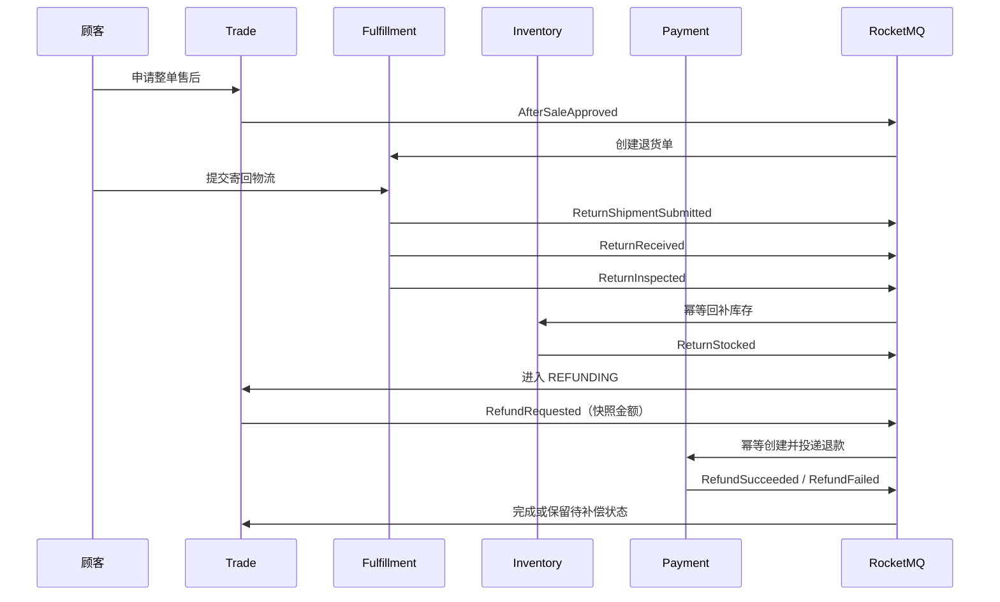

# 整单售后、退货与退款

## 1. 首版边界

M1 只支持已经完成订单的整单退货退款，不支持部分退款、仅退款、换货、多次售后、运费/税费拆分和优惠权益返还。同一订单由数据库唯一约束保证最多一笔售后，默认申请期限为订单完成后 30 天。

退款金额以订单不可变价格快照为准：`trade_order.total_amount` 是退款总上限，`order_item.payable_amount` 是商品行可退金额。系统不会用当前商品价格或当前营销规则重新计价。

## 2. 服务所有权

| 服务 | 最终事实与职责 |
| --- | --- |
| Trade | 售后申请、审核、售后项价格快照、状态历史、退款请求和最终完成 |
| Fulfillment | 退货单、顾客寄回物流、仓库收货与验收 |
| Inventory | 校验原已确认预占，按售后号幂等回补库存并写不可变流水 |
| Payment | 校验原成功支付、创建退款单、投递渠道请求、验签回调和退款结果事件 |

任何服务都不跨 schema 读写。库存回补和渠道退款是两个独立事实，不能通过远程回滚伪装成一个大事务。

## 3. 事件链



每个业务更新与 Outbox 在同一本地事务提交；消费幂等记录与业务副作用同事务提交。所有事件都要求 `payloadVersion = 1`。

## 4. 退款请求与回调

退款单创建后业务状态为 `PROCESSING`，渠道投递状态独立维护：

```text
PENDING -> REQUESTING -> SENT -> 等待独立回调
              |
              +-> PENDING（失败后按同一 refundNo 重试）
              +-> NEEDS_ATTENTION（达到阈值）
```

进程在渠道接受请求后、写回 `SENT` 前退出时，超时抢占恢复会使用同一 `refundNo` 重发，因此真实渠道适配器必须把它作为幂等业务键。`SENT` 不等于退款成功；只有通过 HMAC/渠道官方验签、时间窗、退款单、金额和渠道校验的回调可以改变退款结果。

同一个渠道退款号允许 `FAILED -> SUCCESS`，记录更新为最终成功；每个外部回调事件仍单独保留在 `refund_callback_log`。Trade 已经完成售后后收到晚到失败事件时确认并忽略，不回退成功事实。

## 5. 消息失败与人工恢复

M1 消费者把持续失败消息写入本服务 `consumer_failure`，保存消息 ID、消费组、原始报文、投递次数和最后错误。未达阈值时状态为 `RETRYING`；达到阈值后为 `NEEDS_ATTENTION` 并确认 Broker 消息，避免毒丸永久循环。以后授权重放成功时标记为 `RECOVERED`。

退款渠道投递达到阈值后同样保持退款 `PROCESSING`，管理员可调用：

```text
POST /api/v1/payment/admin/refunds/{refundNo}/retry-dispatch
```

该命令必须携带管理员 JWT、`Idempotency-Key` 和操作原因。只有自动派发耗尽的 `PROCESSING/NEEDS_ATTENTION` 或渠道明确失败的 `FAILED/SENT` 可以执行；`PENDING`、`REQUESTING`、结果未知的 `SENT` 和 `SUCCESS` 均拒绝重投。命令重置投递计数并重新使用原退款号，不直接修改为成功。

Payment 在同一本地事务中锁定退款、校验状态、重置派发并向 `refund_dispatch_retry_audit` 追加接受/拒绝审计。同一命令键重复提交不会再次产生副作用，不同内容复用同一键会返回冲突。审计查询和完整边界见 [领域授权补偿与审计](19-compensation-governance.md)。

## 6. 已验证与未完成

自动测试已经覆盖：整单价格分摊快照、重复申请、审核权限、退货事件幂等、库存回补、退款金额校验、失败后成功、晚到失败、渠道传输超时重试、毒丸隔离、历史订单行号升级和售后申请期限。

真实中间件冒烟必须遵循 [本地开发网络基线](07-local-development-network.md)，先运行网络诊断；脚本默认不停止 Redis，只有显式传入 `-EnableRedisFaultInjection` 才执行 Redis 故障注入。退款补偿验证会在真实 MySQL 退款事实上注入可恢复状态，经 Gateway 执行管理员命令，等待定时派发并核对审计。部分退款、退款失败对账、财务账本和跨领域只读补偿工作台属于后续里程碑。
