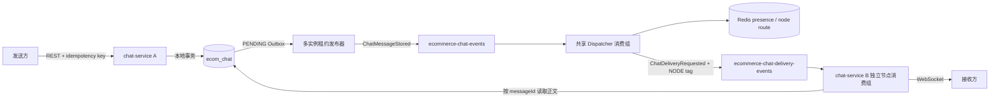

# M8 第二批：聊天实时路由、跨节点投递与离线回放

> 状态：已完成  
> 完成日期：2026-07-23  
> 阶段边界：完成 M8.2 聊天实时投递闭环；不宣称聊天附件、Notification、物流 GEO、评价、搜索、运营统计或整个 M8 完成

## 1. 本批目标

M8.1 已经证明消息和 Outbox 可以在一个 MySQL 本地事务内可靠落库。M8.2 在不改变
事实所有权的前提下补齐实时投递：

- Outbox 只有在 RocketMQ 返回发送成功后才推进；
- 多个 Chat 实例可以共享消费持久化事件，再按在线节点定向投递；
- Redis 只保存带 TTL 的在线节点和用户路由；
- WebSocket 使用 JWT 鉴权，只承担实时接收、心跳和离线回放；
- Broker、Redis、节点或网络异常不能伪造 `DELIVERED`；
- 节点退出后路由自动过期，重连时从 MySQL 回放离线消息；
- 私聊正文不进入 Outbox、RocketMQ 或 Redis。

## 2. 运行拓扑



Gateway 同时提供：

- `/api/v1/chat/** -> lb://chat-service`
- `/ws/chat -> lb:ws://chat-service`

发送消息仍走可靠 REST API。WebSocket 只接受 `PING`，避免把未持久化的 Socket 写入
误当成消息成功。

## 3. Outbox 多实例发布

`outbox_event` 增加并使用以下租约字段：

```text
status, claimed_at, claim_owner, claim_until,
attempts, next_attempt_at, published_at, last_error
```

发布流程：

```text
恢复过期 PUBLISHING 租约
  -> 按会话聚合版本选择最早 PENDING 事件
  -> 条件更新领取租约
  -> 发送 RocketMQ
  -> Broker ACK 后同一事务写 PUBLISHED，并把消息推进到 DISPATCHED
```

发送 ACK 后数据库更新失败时允许重复发布，不能使用“先改已发布、后发消息”的方式
避免重复。重复投递由消息 ID、回执状态单调更新和客户端 `messageId` 去重共同收敛。

同一会话的 Outbox 事件按 `aggregate_version + created_at + id` 排序，前序事件未发布时
后序事件不可越过。多个实例竞争同一事件时，数据库条件更新是最终领取裁决。

## 4. 在线路由与定向投递

Redis 键：

```text
ecommerce:{environment}:chat:node:{nodeId}
ecommerce:{environment}:chat:user:{userId}:nodes
```

- 节点租约和用户路由都带 TTL；
- `{environment}` 取自 `APP_ENV`，防止 local/test/staging 共用 Redis 时互相污染；
- 心跳周期默认 4 秒，presence TTL 默认 12 秒；
- 用户可以同时存在于多个节点；
- Dispatcher 只向当前有效节点发布定向事件；
- 每个节点使用独立消费组和 `NODE_{nodeId}` Tag；
- 节点停止后不需要跨服务改数据库，路由自然过期。

Redis 不是消息正文、已读位置或离线消息的事实来源。未读数仍由
`conversation_member + chat_message` 计算，不写入 Redis。

## 5. 消息与回执状态

消息状态：

```text
STORED -> DISPATCHED -> DELIVERED -> READ
```

接收方回执状态：

```text
OFFLINE -> DELIVERED -> READ
```

两套状态不能混为一个状态机：

- `STORED`：消息和 Outbox 已提交；
- `DISPATCHED`：RocketMQ 已确认接收 `ChatMessageStored`；
- `DELIVERED`：至少一个该用户的本地 WebSocket 会话完成写入；
- `READ`：接收方通过可靠 REST 命令单调推进已读位置；
- `OFFLINE` 只属于接收方回执。没有在线节点时，消息可以保持 `DISPATCHED`，回执仍为
  `OFFLINE`。

当前业务模型是顾客与一个已认领平台客服的会话。一个用户可以有多个 WebSocket
会话，MQ 也允许重复投递，因此同一消息可能到达多个终端或在重连边界重复到达。
客户端必须按 `messageId` 去重；服务端保证数据库状态只单调前进。

## 6. 鉴权与访问边界

- REST 和 `/ws/chat` 都使用 Identity 签发的 JWT Bearer Token；
- JWT `sub` 必须是正整数用户 ID；
- `CUSTOMER` 可以创建会话；
- `ADMIN/OPERATOR` 可以认领会话；
- 读取、发送、已读和实时连接要求 `CUSTOMER/ADMIN/OPERATOR`，具体会话操作仍由
  `conversation_member` 做资源级授权；
- 未认领客服只能查看待认领队列，认领后才能读取或发送该会话内容。

本批真实验证使用能够设置 `Authorization` Header 的标准 WebSocket 客户端。
浏览器原生 `WebSocket` API 不能设置自定义 Authorization Header，因此 M8.2
当时不能被解释为浏览器聊天工作台已经可用。该认证缺口其后已由 M8.4 的一次性、
短 TTL、绑定用户和目标路径的握手票据关闭；长期 JWT 不进入普通查询参数。详见
[M8 第四批：浏览器 WebSocket 短期握手票据](59-m8-chat-browser-websocket-ticket.md)。

## 7. 故障语义

> 2026-07-25 修订说明：下表记录的是 M8.2 交付时的边界。M8.5 初版曾继续依赖
> Broker 不 ACK 重投，但 M8 整体审查通过两次 360 秒失败基线证明新消费组下 POP
> revive 不稳定。当前实现已经改为“失败事实写入 MySQL 后 ACK 原消息，再由 MySQL
> 租约作业恢复”，详见
> [M8 第五批：Chat 持久化消费失败治理](60-m8-chat-consumer-failure-governance.md)。

| 故障 | 系统行为 | 最终恢复 |
| --- | --- | --- |
| RocketMQ 不可用 | 消息保持 `STORED`，Outbox 保持 `PENDING` 并有限重试 | Broker 恢复后重新发布 |
| ACK 后数据库更新失败 | 事件可能重复发布，不提前标记成功 | 租约过期后重发，客户端按 `messageId` 去重 |
| Redis 在握手时不可用 | 清理本地会话并以服务过载关闭 Socket | Redis 恢复后重新连接 |
| Redis 在 Dispatcher 查询时不可用 | M8.2 当时为源事件不 ACK；当前为持久化 `RETRYING` 后 ACK | MySQL 租约作业在 Redis 恢复后重新计算在线节点 |
| Redis 在心跳时不可用 | 记录告警，节点和用户路由按 TTL 过期 | 恢复后心跳重建 |
| 目标节点在写 Socket 前退出 | 不写 `DELIVERED`，回执保持可恢复状态 | 用户重连后从 MySQL 回放 |
| 节点消费到重复定向事件 | 可能再次写入仍在线会话 | 客户端去重，数据库状态单调推进 |
| 无效事件契约 | ACK 防止毒消息永久占用消费循环，并记录错误日志 | M8.2 尚无 Chat 专属持久化 `consumer_failure` 台账 |

最后一项是明确的治理边界：M8.2 已防止毒消息无限重试，但没有把日志包装成持久化
失败治理。后续若将 Chat 作为生产通知入口，应复用既有领域的有限重试、
`NEEDS_ATTENTION` 和审计恢复模式。

## 8. 自动化与静态检查

针对性测试：

```powershell
cd C:\Users\lenovo\Desktop\PlainJournal\backend
mvn -pl services/chat-service -am test
```

结果：

- `platform-common`：14 tests；
- `chat-service`：10 tests；
- 0 失败、0 错误、0 跳过。

新增覆盖：

- Broker 成功后 Outbox `PUBLISHED`、消息 `DISPATCHED`；
- Broker 失败后 Outbox `PENDING`、消息 `STORED`；
- 多实例租约栅栏和同会话事件顺序；
- `OFFLINE -> DELIVERED -> READ` 单调推进；
- WebSocket JWT 数字用户主体校验；
- Redis Key 必须包含 `APP_ENV` 环境命名空间，防止共享 Redis 中的跨环境污染。

PMD：

```powershell
mvn -pl services/chat-service -am org.apache.maven.plugins:maven-pmd-plugin:3.28.0:check
```

结果为 0 违规。

最终全量门禁：

```powershell
mvn clean verify
mvn org.apache.maven.plugins:maven-pmd-plugin:3.28.0:check
```

结果为 73 份 Surefire 报告、258 tests，0 失败、0 错误、0 跳过；12 个
Reactor 模块全部成功，全 Reactor PMD 0 违规。

SpotBugs 低阈值专项：

```powershell
mvn -pl services/chat-service com.github.spotbugs:spotbugs-maven-plugin:4.9.8.2:spotbugs `
  '-Dspotbugs.effort=Max' '-Dspotbugs.threshold=Low' -DskipTests
```

结果为 24 条诊断：Priority 1 为 0、Priority 2 为 15、Priority 3 为 9。
15 条 Priority 2 均是 Spring 单例构造注入的 Mapper、`ObjectMapper`、
`StringRedisTemplate` 或服务依赖被识别为 `EI_EXPOSE_REP2`，没有对外返回这些引用，
不构成状态逃逸。Priority 3 是框架回调或基础设施边界的宽异常声明。

## 9. 真实双实例与故障证据

验证命令：

```powershell
cd C:\Users\lenovo\Desktop\PlainJournal\backend
./tools/verify-m8-chat-realtime.ps1
```

最终证据：

```text
backend/.run/m8-chat-realtime-m8rt20260723160906/verification.json
```

关键结果：

```json
{
  "topology": {
    "customerNode": "m8rt20260723160906-a",
    "agentNode": "m8rt20260723160906-b",
    "gatewayWebSocketNode": "m8rt20260723160906-a",
    "crossNodeDelivery": true,
    "redisKeyPrefix": "ecommerce:m8rt20260723160906:chat:"
  },
  "brokerFailure": {
    "outboxStatus": "PENDING",
    "attempts": 1,
    "messageStatus": "STORED"
  },
  "recovery": {
    "outboxStatus": "PUBLISHED",
    "recoveredDeliveryNode": "m8rt20260723160906-b"
  },
  "nodeExit": {
    "offlineReceiptState": "OFFLINE",
    "offlineMessageStatus": "DISPATCHED",
    "replayedReceiptState": "DELIVERED"
  },
  "privacy": {
    "privateContentInOutbox": 0
  },
  "cleanup": {
    "mysqlRows": 0,
    "redisKeys": 0
  }
}
```

该运行实际启动两个 Chat 实例和一个 Gateway，经 Nacos 路由，使用真实 MySQL、
Redis 和 RocketMQ，验证 Broker 故障恢复、跨节点投递、Gateway WebSocket 路由、
节点退出、路由 TTL、离线回放和正文隐私。脚本按托管 PID、专用端口和
PlainJournal JAR 命令行三重识别临时 JVM，并在 `finally` 清理本次业务行、
Redis Key、端口和进程。

### 9.1 2026-07-25 验证资产清理加固

后续整体审查发现，历史脚本停止了 Chat/Gateway JVM，但没有删除本次创建的
RocketMQ Dispatcher 与节点投递消费组。业务验证结论不受影响，但 Broker 元数据
不满足零残留门禁。

当前脚本已改为：

- 使用 GUID 派生的运行级 Dispatcher 消费组；
- 为 Chat A、Chat B 计算精确的节点投递消费组；
- 成功路径先关闭 WebSocket、停止应用，再删除三个消费组；
- 每个消费组最多删除三次，每次删除后等待并用 `getConsumerConfig` 二次反查；
- `finally` 再执行一次幂等清理；
- 任一消费组仍存在时阻断成功，并在新证据中写入
  `cleanup.residualRocketMqConsumerGroups`；
- 同时按本次消费组清理可能由 RocketMQ 保留消息产生的 `consumer_failure` 行。

历史证据文件保持不改写；下一次真实复验必须同时得到业务闭环通过和
`residualRocketMqConsumerGroups = []`。

## 10. M8.2 结论与后续边界

M8.2 已完成：

- 可靠消息事实到实时投递的完整桥接；
- Outbox 多实例租约、过期恢复和 Broker 故障恢复；
- Redis presence、节点路由和 TTL；
- RocketMQ 跨节点定向事件；
- JWT WebSocket、离线回放和回执状态推进；
- 双实例、节点退出和清理的真实证据。

本报告保留 M8.2 完成时的历史边界。其后 M8.3 已完成：

- 幂等附件上传意图和私有 MinIO 签名上传；
- 大小、MIME、文件头和完整 SHA-256 确认；
- 消息事务内唯一绑定、REST/WebSocket 附件元数据；
- 会话成员授权下载、下载前完整性复核和过期孤儿清理。

详见
[M8 第三批：聊天附件存储、完整性与授权下载](58-m8-chat-attachment-storage-and-authorization.md)。

其后 M8.4 已完成：

- 浏览器长期 JWT 换取短期不透明握手票据；
- Redis 摘要键、跨实例 Lua 单次消费、过期与重放拒绝；
- Redis 故障时签发和握手失败关闭；
- 原有 Authorization Header 客户端兼容。

详见
[M8 第四批：浏览器 WebSocket 短期握手票据](59-m8-chat-browser-websocket-ticket.md)。

以下是 M8.2 交付时尚未完成、现已由后续批次关闭的历史清单：

- 独立恶意文件扫描与隔离区；
- Chat 专属持久化消费失败治理；
- 前端顾客会话与客服工作区；
- Notification；
- 物流 GEO；
- 商品评价、搜索和运营只读统计。

当前阶段状态以
[M8 全面审查、回归与毕业收口](68-m8-full-audit-and-graduation-20260725.md)
为准；M8.1–M8.12 已完成并通过整体门禁。
