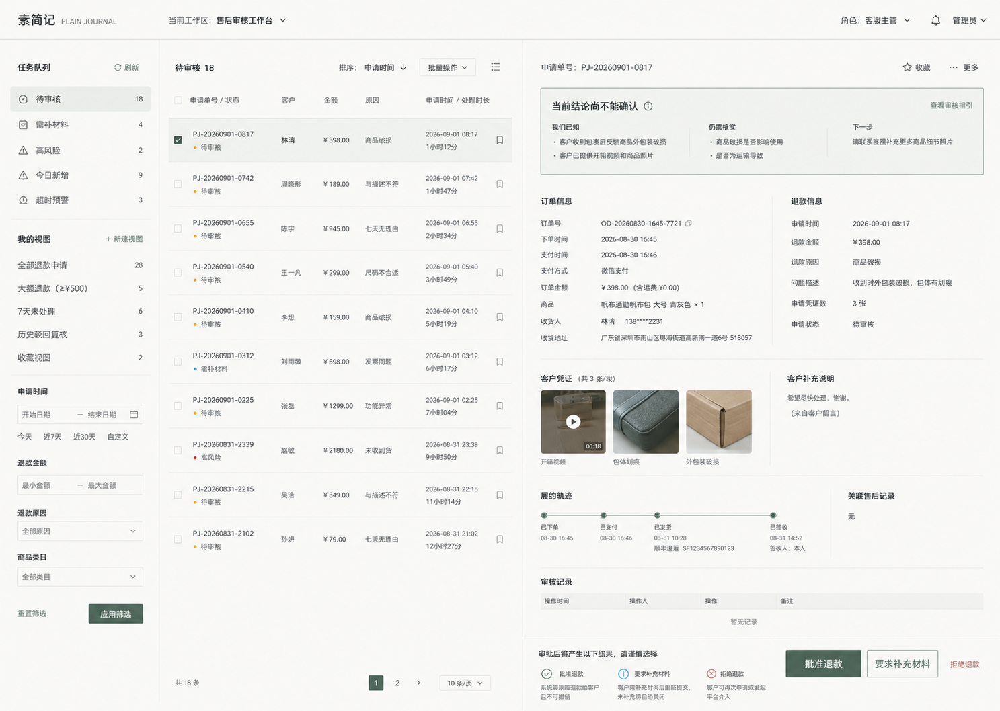

# 素简记前端轻量化重构计划

> 决策日期：2026-08-31  
> 状态：现行前端视觉、布局、组件与迁移基线  
> 范围：`storefront-web`、`admin-web` 及两端共用的设计令牌与无业务 UI 原语  
> 核心决定：停止参考旧《素简记商城平台设计与实施计划书》的前端方案，从页面家族、布局器和数据边界重新建立低耦合实现。

## 1. 为什么重开计划

旧方案把品牌视觉、导航方式、页面结构、组件形态、交互规则和实施阶段写在同一份总计划中。
当它继续向多个页面迁移时，容易出现以下问题：

- 单个艺术页面被当成全部页面的结构模板；
- 为了保持相似外观，共享选择器和覆盖规则跨页面扩散；
- 桌面端与移动端形成两套显示逻辑，改动一端会使另一端漂移；
- 业务页面、装饰底板和卡片结构互相知道得过多；
- 五颜六色、比例不同的真实商品被迫服从固定艺术构图；
- 每增加一种商品、页面或状态，都要继续叠样式，迁移与回归成本持续上升。

因此，从本计划生效开始：

1. 旧计划不再作为前端视觉、布局、组件、响应式或迁移工作的参考；
2. 不从旧计划复制页面结构、样式规则或组件组合；
3. 现有后端事实所有权、接口语义、权限边界和交易状态机仍以 `docs/` 中的现行领域文档为准；
4. 已经验证有效的代码分层门禁继续保留，但视觉实现按本计划重新收口；
5. 旧文件只保留为历史记录，不能通过新增覆盖规则把旧方案继续压在新结构上。

## 2. 参考原则：融合后创新，不做拿来主义

本计划参考的是成熟商城对信息、信任、发现和交易任务的组织方式，不复制品牌视觉、
页面像素、文案、素材、代码或整页结构。

### 2.1 开源前端参考

- [Saleor Storefront / Paper](https://github.com/saleor/storefront)：参考中性底板、页面壳与动态商品区分离、PLP/PDP/Cart/Checkout 组件域分离；
- [Shopify Hydrogen](https://github.com/Shopify/hydrogen)：参考最小骨架、路由与商品图片、价格、表单等能力的独立组合；
- [Medusa Next.js Starter](https://github.com/medusajs/nextjs-starter-medusa)：参考前后端分离和可替换的商业积木；
- [Vercel Commerce](https://github.com/vercel/commerce)：参考商品网格、查询适配层和页面组合边界。

### 2.2 不同市场的电商参考

| 市场与平台 | 只吸收的规律 | 不照搬的部分 |
|---|---|---|
| [淘宝](https://www.taobao.com/)、[京东](https://www.jd.com/) | 分类、搜索、推荐和促销区之间的快速切换；高商品量下的扫描效率 | 促销轰炸、品牌色、活动会场和高密度常驻入口 |
| [抖音商城](https://school.jinritemai.com/doudian/web/home?from=dd&should_full_screen=1) | 内容发现、商城推荐、搜索与商品成交可以是不同入口 | 沉浸视频壳、直播链路和依赖流量分发的页面结构 |
| [日本乐天](https://www.rakuten.co.jp/) | 高信息密度下仍强调排名、可信度和服务入口 | 直接复制密集导航与活动堆叠 |
| [Etsy](https://www.etsy.com/market/unique_handmade) | 非标准、手作和差异化商品可以依靠图片与创作者信息形成发现感 | 平台店铺模型与卖家视觉 |
| [Zalando](https://www.zalando.com/) | 时尚和生活方式商品以图片为主，筛选和尺寸承担决策 | 大图比例、品牌排版和整套时尚视觉 |
| [Shopee](https://shopee.sg/) | 分类、活动、直播和 Daily Discover 分层承接不同浏览意图 | 高频折扣、角标和活动色 |
| [Mercado Libre](https://www.mercadolibre.com.mx/ofertas/) | 到货、免运费、分期和安全信息应在决策位置出现 | 当地支付与物流规则的直接复制 |
| [Flipkart](https://www.flipkart.com/) | 多品类、价格带、节庆活动和本地支付能力需要清晰入口 | 活动密度、视觉语言和本地专属业务 |

### 2.3 素简记自己的融合结果

素简记的视觉语言定义为：

> **纸面留白 × 真实商品 × 可控错落 × 安静交易。**

- 纸面只提供呼吸、明暗和材质，不承担业务层级；
- 商品原色可以五颜六色，背景不与商品争夺注意力；
- 发现页允许像瀑布一样浏览，但错落必须可控；
- 比较、详情、购物袋、结算和后台工作区回到稳定任务布局；
- 信任信息出现在用户决策处，不塞进统一的宣传模块；
- “像素相同”不是一致性，“同一语法”才是一致性。

### 2.4 管理端与特殊页参考

管理端和特殊页不直接套用顾客端商城布局，也不另起一套与品牌无关的后台模板。
本轮只吸收跨产品、跨文化都稳定成立的任务组织规律：

| 参考体系 | 只吸收的规律 | 素简记的取舍 |
|---|---|---|
| [Shopify App Structure](https://shopify.dev/docs/apps/design/app-structure)、[Navigation](https://shopify.dev/docs/apps/design/navigation) | 工作区外壳稳定；导航围绕商家任务；一个页面只承担一个主要目的 | 不复制 Polaris 组件外观，不用卡片墙承载所有后台内容 |
| [SAP Fiori Floorplans](https://experience.sap.com/fiori-design-web/floorplan-overview/)、[Dynamic Page](https://experience.sap.com/fiori-design-web/dynamic-page-layout/) | 总览、工作清单、列表报告、对象详情和集中操作分别使用适合任务的版式 | 不复制企业软件的蓝色主题与厚重页头，只保留任务分型和列表—详情关系 |
| [Ant Design Data Display](https://ant.design/docs/spec/data-display/) | 信息按重要性、频率和关联度排列；表格用于稳定比较；长文本、空值和极端状态预先设计 | 不复制通用后台模板，不用彩色标签替代文字结论 |
| [GitHub Primer PageLayout](https://primer.style/product/components/page-layout/) | 壳层、页头、主区、辅助区和页脚职责明确；窄屏改变排列而不是删除语义 | 不共享整页 CSS，只吸收分区与响应式职责边界 |
| [Atlassian Empty State](https://atlassian.design/components/empty-state)、[Primer Blankslate](https://primer.style/product/components/blankslate/guidelines/) | 空状态说明为什么为空，并只给一个明确的下一步 | 不用插画和大面积装饰掩盖业务状态 |
| [GOV.UK Page Not Found](https://design-system.service.gov.uk/patterns/page-not-found-pages/)、[Error Message](https://design-system.service.gov.uk/components/error-message/) | 说明发生了什么、用户能否修复、下一步去哪里；不责怪用户，不滥用技术术语 | 保留素简记语气与纸面视觉，不复制政府站点样式 |

融合后的管理端气质定义为：

> **同一张纸，另一种工作节奏：顾客端安静浏览，管理端准确判断。**

- 两端共享纸色、墨色、低饱和苔绿、细线、字体角色和基础间距；
- 两端不共享页面壳、导航、业务组件、数据模型或页面级样式；
- 顾客端允许商品图片和错落节奏主导，管理端由任务、事实、状态和操作主导；
- 特殊页属于各自产品入口，由同端壳层和状态原语组合，不建立第三套全局覆盖样式。

## 3. 页面口径与盘点门禁

讨论口径是 34 个目标页面。当前代码路由表可直接确认：

| 产品入口 | 当前路由记录 | 说明 |
|---|---:|---|
| 顾客端 | 20 | 含动态详情路由和兜底页 |
| 管理端 | 13 | 含动态会话路由、登录、无权限和兜底页 |
| 当前合计 | 33 | 不虚构第 34 页 |

实施前必须建立唯一的 `page-registry`，逐条记录页面名称、真实 URL、产品入口、页面家族、
数据所有者、关键状态和桌面/移动验收视口。第 34 个页面只有在产品用途与真实路由确认后
才能进入计划，不能为了数字完整创建空页面，也不能把普通弹层冒充页面。

### 3.1 实施批次与当前进度

实施按“用户端、管理端、其他”三批管理，但只有真实产品路由进入页面总数：

| 批次 | 范围 | 当前进度（2026-09-01） |
|---|---|---|
| 用户端 | `storefront-web` 的 20 条真实路由 | 新初稿 20/20；桌面与移动已按发现、交易、账户沟通三条旅程完成首轮真实浏览器检查，并作为独立批次合入 |
| 管理端 | `admin-web` 的 13 条真实路由 | 新初稿 13/13；桌面与移动已逐页完成首轮真实浏览器检查，并作为独立批次合入 |
| 其他 | 系统架构图、功能模块图、设计文档、验收素材和测试支撑 | 两张架构图已独立验收；注册表、双端基线与漂移门禁单独收口，不计入 33 条产品路由，也不能被当作第 34 页 |

每一批都先完成全部页面的新初稿，再进入逐页优化。这样可以先确认信息结构和真实状态
齐全，再打磨节奏、间距与视觉细节，避免一边补结构一边叠覆盖规则。

## 4. 六类页面家族

34 个目标页面不再各自拥有一套布局。所有页面必须归入以下家族之一：

### A. 发现与精选

适用：首页、场景、专题、编辑精选、新品等以“逛”为目标的页面。

- 使用可控瀑布流或混合网格；
- 允许标准卡、高卡、编辑卡形成节奏；
- 商品顺序来自内容和数据，不用绝对定位摆造型；
- 首屏最多一个主叙事区，之后回到商品流。

### B. 分类、搜索与比较

适用：全部商品、分类、搜索结果、筛选结果、并看。

- 默认使用规整商品网格或列表；
- 标题、价格、关键标签和行动位置稳定；
- 筛选与排序是布局器的外围控制，不侵入商品卡内部；
- 用户需要比较时，整齐优先于错落。

### C. 商品详情与决策

适用：商品详情、规格、媒体、评价和购买决策。

- 桌面采用媒体区与决策区分层组合；
- 移动端使用同一内容顺序纵向展开，不复制另一棵 DOM；
- 商品事实、购买动作和补充内容分别拥有明确区域；
- 不使用瀑布流承载价格、规格或购买动作。

### D. 购物袋与结算任务

适用：购物袋、结算、支付恢复、交易确认。

- 使用稳定任务列、摘要和步骤区；
- 一个阶段只保留一个主推进动作；
- 价格、库存、配送和结果未知状态不被装饰层覆盖；
- 不使用不等高商品流制造跳读。

### E. 账户、订单、售后与沟通

适用：登录、注册、账户、地址、通知、订单、售后、客服。

- 采用列表、时间线、表单和状态面板；
- 关键事实不因移动端而隐藏；
- 动态详情路由复用同一家族，不另建一套视觉框架；
- 空、错、加载、无权限和结果未知都属于正式页面状态。

### F. 管理工作区

适用：商品观察、履约、售后、库存、营销、治理、客服和评价。

- 使用工作区壳、数据列表、详情区和行动区；
- 保持高信息密度，但不以卡片套卡片表达代码层级；
- 桌面与移动共享信息模型，移动端通过重排或详情入口保留判断所需事实；
- 后台不得直接复用顾客端页面组件，只能复用无业务令牌与原语。

#### F.1 已选定的主范式：双栏事务台

2026-09-01 选定“**双栏事务台 / Split Workbench**”作为管理端主工作区的视觉与信息结构基线。
名称中的“双栏”指“任务选择”和“事实处置”两段工作逻辑；桌面实现展开为三个明确区域：

```text
任务与筛选栏  →  案件 / 对象队列  →  事实、上下文与处置区
```



该方向锁定以下规则：

1. 左侧只负责找任务、保存视图和收窄范围，不放对象详情；
2. 中间只负责扫描、比较和选择，不在每一行展开完整表单；
3. 右侧只负责当前对象的事实、证据、历史、状态解释和处置；
4. 主操作跟随当前对象固定在处置区末端，不能漂到全局页头或列表行中；
5. 状态必须同时使用文字、结构和必要的弱色彩，不得只靠颜色；
6. 列之间用留白与细分隔线建立层级，不用卡片套卡片；
7. 详情区允许局部滚动，任务队列和当前对象标识必须保持上下文连续；
8. 任何管理页面若不需要某一栏，应删除该栏并让剩余布局自然扩展，不保留空壳占位。

#### F.2 管理端四种任务版式

“双栏事务台”是主范式，不是强迫十三个页面长得完全相同。管理端页面按任务选择以下版式：

| 版式 | 适用页面 | 必备结构 |
|---|---|---|
| 事务队列 | 售后、履约异常、评价审核、治理事件 | 任务筛选 + 对象队列 + 事实处置区 |
| 清单工作区 | 商品、库存、营销规则 | 搜索筛选 + 可比较清单 + 对象抽屉或独立详情入口 |
| 会话工作区 | 客服会话及会话详情 | 会话队列 + 消息正文 + 顾客 / 订单上下文 |
| 运营总览 | 管理首页 | 少量关键指标 + 异常入口 + 最近工作；不得变成指标卡墙 |

页面只能选择一种主版式。局部组件可以复用，但不得把四种版式叠在同一页面。

#### F.3 移动端降维规则

移动端不是把桌面三栏同时压进窄屏，也不是隐藏事实，而是把同一任务拆成连续三步：

```text
任务列表  →  对象摘要与事实  →  处置确认
```

- 进入详情后保留明确返回队列入口、当前筛选条件和对象编号；
- 桌面表格在窄屏转为语义行或摘要列表，字段顺序保持稳定；
- 风险、金额、时间、当前状态、事实来源和操作后果不得因窄屏消失；
- 主操作可以使用底部行动栏，但不能遮挡最后一条事实或系统反馈；
- 桌面与移动必须读取同一视图模型和同一状态机，不复制第二套页面数据。

#### F.4 特殊页面与特殊状态

特殊页延续“同一张纸”的视觉语言，但密度低于管理工作区。它们不使用双栏事务台的完整结构，
只复用同端壳层、页面宽度、文字角色、按钮和状态原语：

| 类型 | 页面必须回答 | 主动作规则 |
|---|---|---|
| 登录 / 注册 | 我是谁、正在进入哪个入口、需要提供什么 | 表单列保持受控宽度；一个主提交动作；允许一块安静贴图填补大屏留白，但贴图不承载信息 |
| 无权限 | 当前角色为什么不能进入、允许去哪里、如何申请权限 | 一个“返回有权限的工作区”主动作；申请或联系管理员为次要链接 |
| 404 / 空状态 | 什么内容不存在或尚未产生、是否需要调整条件 | 一个安全返回或创建动作；不用“糟糕”“迷路了”等情绪化文案 |
| 加载 / 局部空 | 哪一块正在读取、原有上下文是否仍有效 | 在原容器内占位，不用整页白屏替换工作区 |
| 错误 / 结果未知 | 已确认什么、尚不能确认什么、下一步如何安全恢复 | 显示参考编号与可重试边界；不得把结果未知写成失败或成功 |
| 成功 / 完成 | 哪个动作完成、产生了什么事实、下一步是否必要 | 只在复杂或跨页面操作完成后使用独立结果页；普通保存留在原上下文反馈 |

特殊状态文案统一采用：

```text
发生了什么  →  已确认的事实  →  尚未确认的部分  →  唯一安全下一步
```

禁止为登录、无权限、404、空状态和结果页分别建立互相竞争的全局颜色与页面级强压规则。

## 5. 四层视觉结构

```text
背景层       纸色、纹理、极弱光影
布局层       页面宽度、网格、瀑布、任务列、工作区
内容层       商品卡、事实行、媒体、状态、表单
交互层       搜索、筛选、选择、购买、恢复与治理动作
```

规则：

1. 背景层不得读取商品、账户、订单或工作区状态；
2. 布局层只决定排列，不发请求、不持有业务状态；
3. 内容组件接收明确视图模型，不直接读取其他 feature 的 store；
4. 交互组件通过公开入口调用意图，不反向修改别的领域事实；
5. 任一层都不能用全局覆盖规则修补上一层的结构问题。

## 6. 底板策略

### 6.1 默认方案

默认使用简单 CSS 建立底色、细微明暗和必要纹理。它应当：

- 低对比；
- 不依赖固定屏幕尺寸；
- 随页面自然滚动或只产生极轻的视差；
- 不创建新的内容容器；
- 不影响商品图片颜色判断。

### 6.2 可选画布或贴图

只有当纯 CSS 无法表达必要材质时，才允许使用一张经过压缩的底板图或纯装饰画布。

- `pointer-events: none`；
- 不承载文字、商品、按钮和连线；
- 不决定内容高度；
- 必须有纯色/CSS 回退；
- 移动端可以裁切或降级，不能复制一套页面；
- 尊重 `prefers-reduced-motion`；
- 不因背景滚动导致内容抖动或重排。

## 7. 布局器，而不是页面专属 CSS

现行目标布局器：

| 布局器 | 用途 |
|---|---|
| `StoreShell` / `WorkspaceShell` | 顾客端与管理端各自的应用壳 |
| `PageFrame` | 内容最大宽度、页边距和纵向节奏 |
| `SectionStack` | 章节间距，不制造可见卡片 |
| `ProductGrid` | 可比较的规整商品列表 |
| `ProductMasonry` | 发现页的可控错落商品流 |
| `DetailSplit` | 商品媒体与决策信息布局 |
| `TaskColumn` | 购物袋、结算、账户和表单任务 |
| `WorkspaceGrid` | 后台列表、详情和行动区 |

布局器不得知道商品 API、订单状态、权限角色或路由名称。页面只选择布局器并提供内容。

## 8. 卡片系统

商品展示只保留少量稳定变体：

- `standard`：分类、搜索和普通推荐；
- `tall`：适合竖图、服装、包袋与场景照片；
- `editorial`：编辑说明与少量精选商品；
- `compact`：横向推荐、购物袋补充和移动端紧凑列表。

所有商品卡共享同一事实顺序：

```text
图片 → 商品名 → 一句事实 → 价格 → 必要的信任/状态信息
```

约束：

- 卡片高度可以不同，但同类卡片的内部间距和文字角色一致；
- 图片比例由少量令牌控制，不由每个页面临时指定；
- 卡片不嵌套另一张视觉卡片；
- 不用阴影和边框同时反复包裹层级；
- 行动按钮只在任务需要时出现，不为对称强行补齐；
- 价格、库存和配送信息不能因图片比例不同而失去可读性。

## 9. 瀑布流的使用边界

瀑布流只服务发现，不是全站基础布局。

- DOM 阅读顺序必须稳定；
- 不使用绝对定位计算整页坐标；
- 图片提供固有宽高或 `aspect-ratio`，避免加载后跳动；
- 桌面端列数由容器宽度决定，移动端自然降为一列或两列；
- 核心商品事实不能藏在悬停状态；
- 分类、搜索比较、结算和后台页面禁止套用瀑布流；
- 无法可靠实现时回退为 `ProductGrid`，内容和交互不丢失。

## 10. 代码与样式边界

继续沿用现有单向依赖：

```text
design-system / foundation → shared → entities → features → pages → app
```

新增约束：

1. `design-system` 只拥有品牌令牌、语义色、字体、间距、边界、动效和图片比例；
2. `ui` 只拥有无业务原语和布局器，不依赖 `foundation` 业务契约；
3. 顾客端和管理端不能互相导入页面、样式或业务组件；
4. 两端相似只能通过令牌和无业务原语实现，不能共享整页 CSS；
5. 页面样式必须就近归属，不向全局样式表追加页面选择器；
6. 禁止使用 `!important`、选择器竞赛和重复媒体查询修补层级；
7. 禁止为了让两个页面“看起来一样”复制 DOM 后再分别覆盖；
8. 卡片接收纯视图模型，API DTO 在 entity/feature 边界完成映射；
9. 页面负责组合，不拥有可以被下层复用的业务状态机；
10. 背景、布局器、卡片和业务旅程分别测试。

## 11. 响应式原则

- 桌面与移动端使用同一页面结构和同一事实集合；
- 断点只改变排列、密度和次要装饰，不删除判断所需信息；
- 关键操作在触屏下保持可触达和可读；
- 移动端不另建“简化页面”，也不靠 `display: none` 丢弃事实；
- 页面不产生主内容横向滚动；只有明确的比较器、媒体带等局部组件可以横向滚动；
- 每种页面家族至少定义一个窄屏、一个普通桌面和一个宽屏验收视口。

## 12. 迁移顺序

### 阶段 0：冻结与盘点

- 冻结旧前端计划；
- 建立页面注册表，解决 33/34 口径差异；
- 为每个现有页面保存桌面与移动基线截图；
- 标记全局样式、遗留目录和跨页面覆盖来源；
- 不改业务与视觉。

### 阶段 1：底板和布局器试点

- 只建立背景层、`PageFrame`、`SectionStack`、`ProductGrid` 和 `ProductMasonry`；
- 选择一个发现页作为试点；
- 不同时迁移详情、结算或后台；
- 试点验收后才允许复用布局器。

### 阶段 2：发现、分类与搜索

- 先发现页，再分类页，再搜索页；
- 每完成一页，都回归其他已完成页面；
- 验证不同图片比例、长短标题、价格与缺货状态。

### 阶段 3：详情与交易

- 商品详情；
- 购物袋；
- 结算与支付恢复；
- 订单、履约与售后；
- 一次只迁移一条真实用户旅程。

### 阶段 4：账户与沟通

- 登录注册；
- 账户与地址；
- 通知、权益与客服；
- 保证移动端不丢事实。

### 阶段 5：管理工作区

- 先共用工作区壳和数据布局器；
- 再按 Catalog、库存、履约、售后、营销、治理、客服、评价逐页迁移；
- 每页保留权限、未知结果和事实所有者边界。

### 阶段 6：全站收口

- 删除已确认无调用的旧样式；
- 不保留“以防万一”的强压覆盖；
- 运行边界、类型、单元、契约、E2E、构建和无障碍门禁；
- 真实浏览器逐页核对桌面与移动端；
- 最后更新交付截图和现行文档。

## 13. 单页迁移闭环

每次只动一个页面或一个有明确共享边界的布局器：

1. 记录迁移前桌面与移动截图；
2. 说明该页属于哪个页面家族；
3. 只修改该页拥有的组合和样式；
4. 在真实数据长度、空状态、错误、加载和结果未知下检查；
5. 截取迁移后桌面与移动截图；
6. 复查所有已经完成的页面是否漂移；
7. 运行自动化和分层门禁；
8. 浏览器确认后才进入下一页。

如果改动一页导致其他页面漂移，先停止迁移并修复所有权边界，禁止用新的覆盖规则继续压平。

## 14. 验收标准

### 视觉

- 商品原色不被底板污染；
- 错落有节奏，但标题、价格和关键信息仍可扫描；
- 不出现卡片套卡片、装饰框叠加和无意义阴影；
- 页面家族之间有共同气质，也能清楚区分浏览、决策和任务状态。

### 响应式

- 桌面与移动端事实一致；
- 无页面级横向滚动；
- 无关键操作消失、箭头断裂、重叠或漂移；
- 图片加载前后不产生影响决策的布局跳动。

### 工程

- 顾客端与管理端互不受页面级样式影响；
- 无新增跨层导入、跨 feature 深层导入或业务状态复制；
- 无新增 `!important` 和全局页面选择器；
- 布局器可以独立测试，卡片可以用不同商品数据验证；
- 页面迁移不改变后端事实所有权、接口语义、权限和交易状态机。

### 成本

- 新增同家族页面以组合与配置为主，不复制整页样式；
- 新增商品不要求修改页面 CSS；
- 更换底板不影响内容和业务组件；
- 调整一个页面不会改变另一个页面的布局结果。

## 15. 明确不做

- 不把某个参考商城或某个已经完成的素简记页面直接复制成全站模板；
- 不用 34 份页面 CSS 描述 34 种艺术构图；
- 不把商品正文画进 Canvas；
- 不建立桌面版和移动版两套页面；
- 不为了统一而强制所有卡片等高、等宽或信息等量；
- 不为了错落而破坏比较、阅读顺序和交易清晰度；
- 不在视觉重构中顺便修改微服务事实、权限或状态机；
- 不一次性重写两端，也不在没有逐页浏览器证据时宣称完成。

## 16. 最高规则

> **参考五湖四海，提炼共同规律；不复制任何一家，形成素简记自己的秩序。**
>
> **底板保持轻，布局器保持纯，卡片保持少，页面只负责组合。**
>
> **发现可以错落，比较必须稳定，交易必须清楚，事实必须完整。**

## 17. 第一轮迁移进度（2026-09-01）

- 顾客端第一轮已经闭环并独立提交；页面组合、业务实体与管理端不互相导入。
- 管理端第一轮已经闭环：运营首页、商品目录、履约、售后、库存、营销、治理、客服和评价均已完成桌面与移动端真实浏览器回归。
- 管理端只共享无业务含义的 `ListWorkbench` 与 `SplitWorkbench` 布局器；页面状态机、字段、命令、恢复流程和页面级样式仍由各页面及所属实体切片拥有。
- 本轮管理端质量门禁结果：17 条 V6.4 E2E、96 条单元测试、类型检查、生产构建、分层边界与差异检查全部通过；九个真实路由在桌面和移动端均无页面级横向溢出。
- 下一批进入登录、无权限、404 等“其他 / 特殊页面”，不再回头改动已闭环的顾客端和管理端布局，除非回归证据证明存在真实缺陷。
