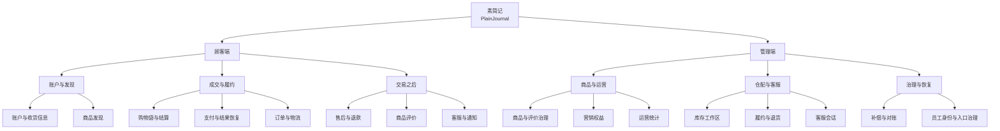

# 功能模块图施工底稿

> 本文先固定功能分解，再由 `functional-modules.html` 负责视觉呈现。
> 图的目标是回答“素简记提供哪些功能”；服务、数据库和消息流不进入主功能树。

## 1. 分解原则

```text
素简记
  ├─ 顾客端
  │   ├─ 账户与发现
  │   ├─ 成交与履约
  │   └─ 交易之后
  └─ 管理端
      ├─ 商品与运营
      ├─ 仓配与客服
      └─ 治理与恢复
```

- 第一层按真实产品入口拆分：顾客端、管理端。
- 第二层按用户任务域拆分，不按微服务名称拆分。
- 第三层是 16 个可以在真实页面或工作区找到的功能模块。
- 主责服务另列映射索引，不写进主树节点，不让技术所有权干扰产品阅读。

## 2. 顾客端：8 个模块

| 功能域 | 模块 | 核心能力 |
| --- | --- | --- |
| 账户与发现 | 账户与收货信息 | 注册登录、会话恢复、账户资料、地址与登录风控 |
| 账户与发现 | 商品发现 | 目录、搜索、详情、SKU、价格与媒体 |
| 成交与履约 | 购物袋与结算 | 游客袋合并、价格/库存/权益复核、稳定幂等提交 |
| 成交与履约 | 支付与结果恢复 | 支付单、验签回调、重复请求与结果未知恢复 |
| 成交与履约 | 订单与物流 | 订单快照、履约时间线、最新位置与确认收货 |
| 交易之后 | 售后与退款 | 售后申请、退货验收、退款、回补与对账 |
| 交易之后 | 商品评价 | 评价资格、评价、回复、点赞、举报与审核 |
| 交易之后 | 客服与通知 | 会话、可靠消息、安全附件、站内信与邮件偏好 |

## 3. 管理端：8 个模块

| 功能域 | 模块 | 核心能力 |
| --- | --- | --- |
| 商品与运营 | 商品与评价治理 | 商品维护边界、搜索重建、评价审核与举报处理 |
| 商品与运营 | 营销权益 | 规则、地区限制、权益发放/锁定与秒杀资格 |
| 商品与运营 | 运营统计 | 来源事件、日/商品汇总、对账、重建与总览 |
| 仓配与客服 | 库存工作区 | 多仓库存、流水、盘点、预占、释放与回补 |
| 仓配与客服 | 履约与退货 | 拣货、打包、发货、轨迹、异常与退货验收 |
| 仓配与客服 | 客服会话 | 会话认领、上下文校验、多节点路由与附件恢复 |
| 治理与恢复 | 补偿与对账 | 所有者域内恢复、稳定命令 ID、原因与追加审计 |
| 治理与恢复 | 员工身份与入口治理 | 员工登录、角色门禁、入口鉴权、限流与追踪 |

## 4. Mermaid 结构草图



## 5. 主责服务映射索引

这张表用于文档门禁和图后查阅，不进入主功能树。

| 模块 | 主责服务 |
| --- | --- |
| 账户与收货信息 | `identity-service` |
| 商品发现 | `catalog-service` |
| 购物袋与结算 | `trade-service` |
| 支付与结果恢复 | `payment-service` |
| 订单与物流 | `trade-service` |
| 售后与退款 | `trade-service` |
| 商品评价 | `catalog-service` |
| 客服与通知 | `chat-service` |
| 商品与评价治理 | `catalog-service` |
| 营销权益 | `marketing-service` |
| 运营统计 | `analytics-service` |
| 库存工作区 | `inventory-service` |
| 履约与退货 | `fulfillment-service` |
| 客服会话 | `chat-service` |
| 补偿与对账 | `payment-service` |
| 员工身份与入口治理 | `identity-service` |

## 6. HTML 落图约束

1. 主树使用清晰的主干、直角分支或大括号关系；不使用散落卡片模拟层级。
2. 两个入口、六个功能域、十六个模块必须同时可见。
3. 模块节点只显示功能名称与一句能力摘要，不显示服务名、Schema、端口或事件。
4. 主责服务映射放在主树下方的独立索引，视觉权重低于主图。
5. 主树纵向展开：根节点在上，顾客端与管理端分成两个完整章节，功能域和模块继续向下展开。
6. 不使用角色筛选、节点淡出、自动切换或会使文字消失的动画。
7. 桌面端和移动端都只使用页面纵向滚动；功能主图不产生横向滚动条，也不把模块压成难以辨认的窄列。
8. 桌面扇出树与移动线性树由同一份功能数据分别生成，不在同一 DOM 上强压改形。移动端只在真实父子层级之间画居中箭头；同一功能域内的模块放进一个轻量集合框，模块之间不画顺序箭头，也不叠加入口框、功能域框和画布框。
