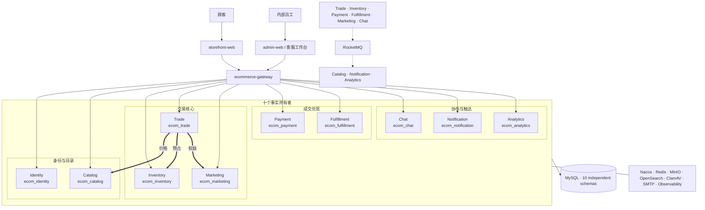

# 系统架构图施工底稿

> 本文先固定“画什么”，再由 `system-architecture.html` 负责“怎样呈现”。
> 图的目标是回答系统由哪些运行单元组成、请求与事件怎样流动、最终事实落在哪里；
> 不再承担“为什么拆成这些服务”的论证任务。

## 1. 读图顺序

```text
素简记
  ↓
顾客 / 顾客端    内部员工 / 管理端
  ↓
统一网关
  ↓
四个所有权域 / 十个事实所有者
  ↓
协作路径与运行底座
```

页面采用与功能模块图一致的纵向主树范式：居中叙事轴、根节点、精确分支、图后索引和
边界说明。桌面端与移动端都只需上下浏览；窄屏按层级堆叠，但不改变节点的事实含义。

## 2. 节点清单

### 2.1 使用者与客户端

| 层级 | 节点 | 说明 |
| --- | --- | --- |
| 使用者 | 顾客 | 浏览、交易、评价、售后与客服 |
| 使用者 | 内部员工 | 运营、仓库、客服、财务与治理 |
| 客户端 | `storefront-web` | 顾客商城 |
| 客户端 | `admin-web` | 管理后台与客服工作台 |
| 边界 | `ecommerce-gateway` | 路由、鉴权前置、限流与追踪；不拥有领域事实 |

### 2.2 十个事实所有者

| 领域组 | 服务 | 最终事实 | Schema |
| --- | --- | --- | --- |
| 身份与目录 | `identity-service` | 账号、地址、RBAC、令牌与登录风控 | `ecom_identity` |
| 身份与目录 | `catalog-service` | 商品、价格、媒体、评价与搜索推进事实 | `ecom_catalog` |
| 交易核心 | `inventory-service` | 现货、预占、释放、扣减与库存流水 | `ecom_inventory` |
| 交易核心 | `trade-service` | 购物袋、结算、订单快照与售后申请 | `ecom_trade` |
| 交易核心 | `marketing-service` | 营销规则、权益、定价锁与秒杀资格 | `ecom_marketing` |
| 成交兑现 | `payment-service` | 支付单、回调、退款与对账 | `ecom_payment` |
| 成交兑现 | `fulfillment-service` | 履约、运单、轨迹、位置与退货收货 | `ecom_fulfillment` |
| 协作与触达 | `chat-service` | 会话、消息、回执与附件安全状态 | `ecom_chat` |
| 协作与触达 | `notification-service` | 站内信、邮件偏好、投递与恢复 | `ecom_notification` |
| 协作与触达 | `analytics-service` | 来源事件、汇总、对账与重建记录 | `ecom_analytics` |

### 2.3 基础设施

| 节点 | 用途 | 所有权边界 |
| --- | --- | --- |
| MySQL 8.4 | 十个独立 Schema 保存最终事实 | 只有所属服务可以写 |
| Nacos | 服务发现与配置 | 不拥有业务事实 |
| Redis | 缓存、准入、租约、路由与 GEO | 故障时不能伪造成最终事实 |
| RocketMQ | 版本化领域事件 | 允许重复投递，消费者必须幂等 |
| MinIO | 商品媒体与私有附件 | 对象访问必须重新校验业务权限 |
| OpenSearch | 可重建商品搜索投影 | Catalog MySQL 才是商品事实 |
| ClamAV | 附件内容扫描 | Chat MySQL 保存最终附件状态 |
| SMTP | 邮件投递通道 | 接受邮件不等于交易成功 |
| Observability | 指标、追踪与告警 | 只观察，不替领域服务下结论 |

## 3. 连线规则

- 普通实线：浏览器请求经 Gateway 到所有者服务。
- 加重实线：用户必须立即知道结果的同步短链。
- 虚线：Outbox 经 RocketMQ 发布和消费的异步收敛。
- 细线：服务与自己的 Schema 或可恢复基础设施之间的依赖。
- 任何连线都必须有方向；不使用只为装饰而存在的线。

同步短链只画仓库已经明确的核心关系：

```text
Trade → Catalog：商品与当前价格
Trade → Inventory：库存预占与最终裁决
Trade → Marketing：权益计算与锁定
```

事件关系按生产者与消费者汇总，避免画出无法阅读的全连接蜘蛛网：

```text
Trade / Inventory / Payment / Fulfillment / Marketing / Chat
  → RocketMQ
  → Catalog / Notification / Analytics
```

## 4. Mermaid 结构草图



## 5. HTML 落图约束

1. 主树沿用功能模块图的视觉范式，但只回答访问链与事实所有权，不混入产品功能分解。
2. 根节点、两个产品入口、统一网关、四个所有权域和十个服务必须同时可见。
3. 每个服务只显示服务名、职责短语和 Schema，不显示端口或长段解释。
4. 同步短链、RocketMQ 收敛与运行底座移入主树后的独立索引，避免在主图制造蜘蛛网。
5. 卡片统一使用取自青荷陶杯的低饱和灰绿渐变；连接线、间距和箭头复用同一套树图度量。
6. 雨后斜光、雨滴、左下荷叶与氤氲只存在于系统架构页的独立底板层。
7. 桌面端与移动端都只使用纵向页面滚动，不产生主图横向滚动条。
8. 不使用筛选淡出节点，不使用自动播放，不让任何信息在切换后消失。
9. 桌面端的四个所有权域保持同一行并列，由网关下方的一条标准分支统一落到域节点；
   同一域内的服务也是并列事实所有者，不画服务之间的方向箭头。域节点只用一段短线
   接到轻量包含框，框内服务保持等距排列；不增加贯穿卡片的长侧轨或装饰性色条。
10. 窄屏不把并列节点强画成纵向流程：两个产品入口和四个所有权域分别进入一个轻量包含框，
    框内按阅读顺序堆叠但不画相邻节点箭头；根节点、入口集合、网关、所有权域集合和服务集合之间的真实层级使用统一居中主干与小箭头表达，不用后置高特异性规则覆盖桌面分支。
